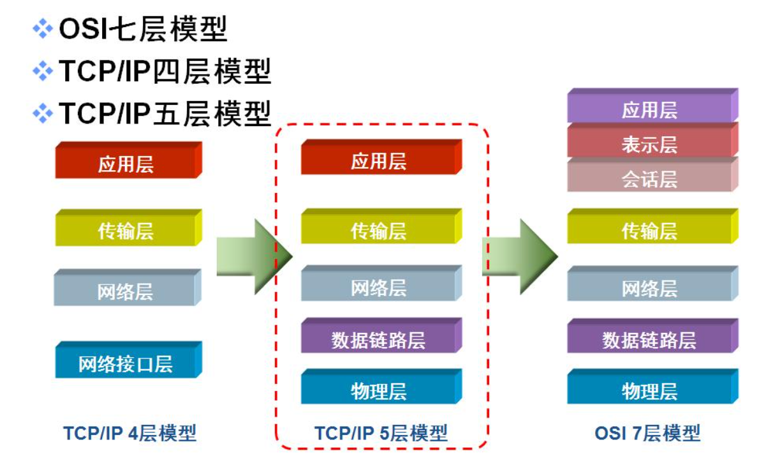
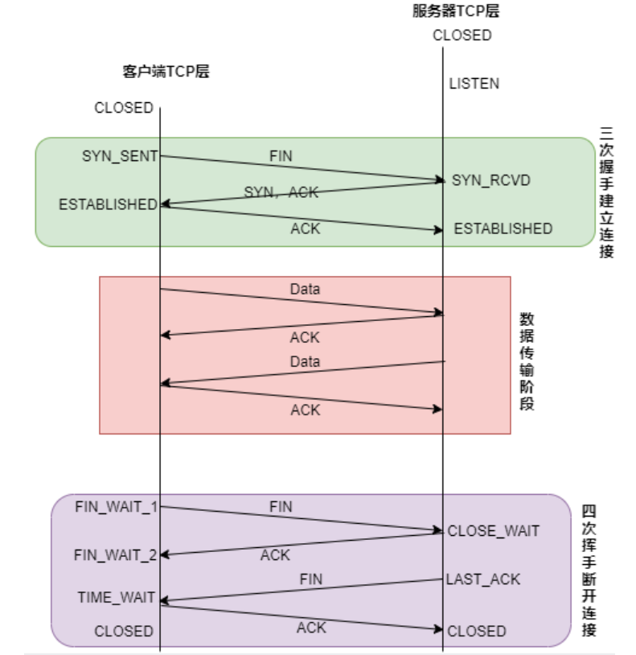
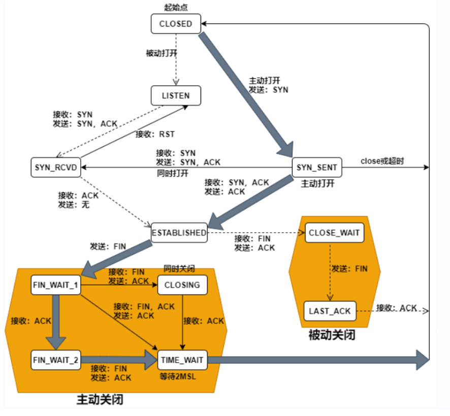
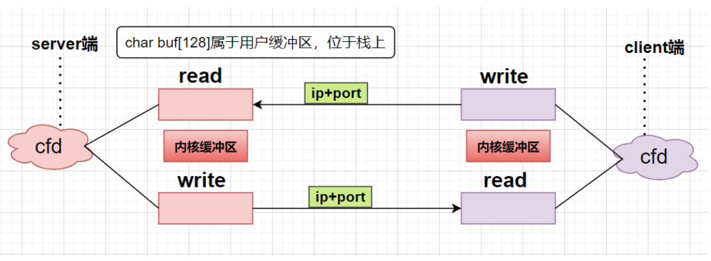
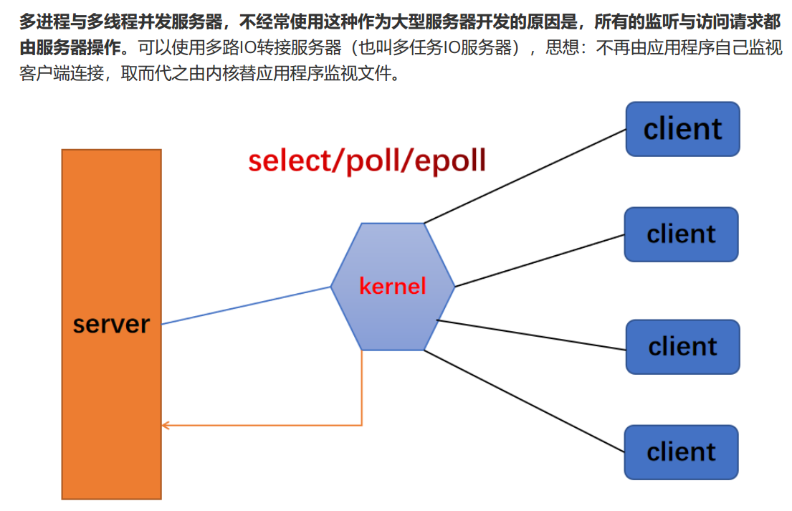
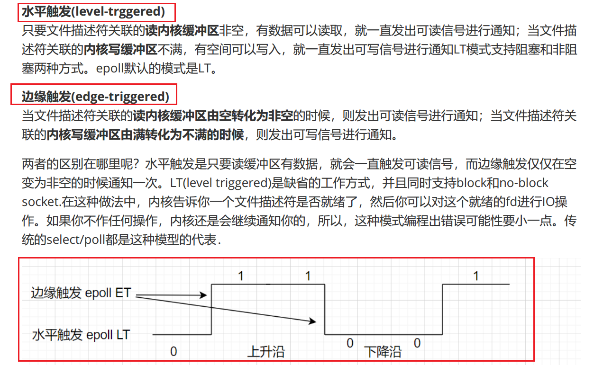
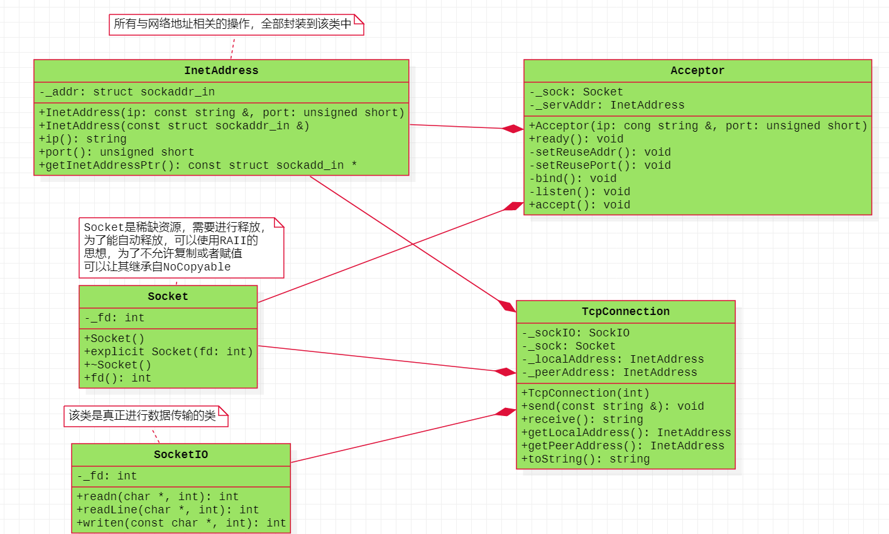

## 计算机网络

### 1、网络模型

OSI七层模型、TCP/IP四层（五层）模型



### 2、每一层数据包的名字


### 3、每一层的协议格式

以太网帧格式、IP段格式、TCP数据报格式、UDP数据报格式

### 4、TCP协议（重点）

TCP协议是一个传输层的协议；TCP面向连接的协议；TCP是一个可靠的协议；TCP是全双工的协议。

**TCP的建立连接的三次握手、断开连接的四次挥手？SYN、ACK、FIN（这个是面试常考点）**

相应的文字解析，希望自己可以看看课件，自己好好复习一下。



### 5、TCP状态迁移图（重点）

记住其中的11个状态；以及使用代码验证这部分状态。

可以使用nc命名

```bash
nc ip   port

nc 127.0.0.1 8888
```




**半关闭状态、2MSL？**

### 6. 散知识

网络字节序、主机字节序、大端、小端

### 7.  网络编程函数

#### 结构体

```cc
struct sockaddr {
	sa_family_t sa_family;
    char sa_data[14];
};

struct sockaddr_in {
    sa_family_t sin_family;
    in_port_t sin_port;
    struct in_addr sin_addr;
};

struct in_addr {
    uint32_t s_addr;
};
```

#### 函数

socket、bind、listen、accept、connect、close

##### 服务器

```C++
int lfd = socket;
bind;
listen;//服务器处于监听状态
int cfd = accept;//cfd有正常值的时候，证明三次握手已经完成（TCP连接已经建立）

while(1)
{
    //服务器真正的业务逻辑
    read;
    //
    //....
    //
    write;
}

close(lfd);//四次挥手
close(cfd);
```

##### 客户端

```C++
int lfd = socket;
connect;
while(1)
{
    //客户端的业务逻辑
     read;
    //
    //....
    //
    write;
}

close(lfd);//四次挥手
```



#### 端口复用

```C++
int opt = 1;
setsockopt(listenfd, SOL_SOCKET, SO_REUSEADDR, &opt, sizeof(opt));
int opt = 1;
setsockopt(listenfd, SOL_SOCKET, SO_REUSEPORT, &opt, sizeof(opt));
```


## IO多路复用


#### 1、基本思想



**位图、跳表两个数据结构**

#### 2、select

```C++
int select(int nfds, fd_set *readfds, fd_set *writefds,
           fd_set *exceptfds, struct timeval *timeout);

void FD_CLR(int fd, fd_set *set);
int  FD_ISSET(int fd, fd_set *set);
void FD_SET(int fd, fd_set *set);
void FD_ZERO(fd_set *set);
```

客户端与服务器连接的读事件，1、客户端请求与服务器进行连接的事件   2、客户端发送数据给了服务器，此时服务器需要读这个数据


#### 3、poll

```C++
#include <poll.h>
int poll(struct pollfd *fds, nfds_t nfds, int timeout);

struct pollfd 
{
    int   fd;         /* file descriptor */
    short events;     /* requested events */
    short revents;    /* returned events */
};
```


#### 4、epoll




```C++
select/poll/epoll

listenfd       select   监听

//listenfd新的连接请求的标志
if(listenfd == 读事件)
{
    //有新的连接请求进来
    connfd = accept();
   //只要connfd是正常的
}

//之前老的连接上面有新的数据传送过来，write
if(connfd == 读事件)
{
    n = read;
    if(n > 0)
    {
        //数据能正常的接收
        //全部转换为大写
        //write回给客户端
    }
    else if(n == 0)
    {
        //客户端要断开连接
        //close(connfd);
    }
    else if(n == -1)//异常
    {
        close;
        return ;
    }
}

listenfd
    
nready = select/poll;
nready = 5;//有五个读事件满足条件
if(读事件 == listenfd)//有新的连接请求上来
{
    confd = accept;
    confd存在数据结构里面
}

if(读事件 == confd)//老客户端有新的需要读数据传过来，
{
    n = read;
    if(n > 0)
    {
        //数据能正常的接收
        //全部转换为大写
        //write回给客户端
    }
    else if(n == 0)
    {
        //客户端要断开连接
        //close(connfd);
    }
    else if(n == -1)//异常
    {
        close;
        return ;
    }
    
}
```


### 五、回调函数

C语言  回调函数

```C++
int pthread_create(pthread_t *thread, const pthread_attr_t *attr,
                          void *(*start_routine) (void *), void *arg);

void *threadFunc(void *arg)
{
    //
}

//C语言  中的结构体可以一次存大量数据
//void *
pthread_create(&thid, nullptr, threadFunc, arg);//注册threadFunc回调函数

//C语言中有个函数指针，有了结构体
void (*pFunc)();

pFunc = add;
pFunc = func;
```

C++中的多态：类、虚函数、继承

C中：struct、函数指针


C++

```C++
void func(int x, int y)
{
    
}
funtion<void()> f = bind(func, _1, _2);//func注册
//业务逻辑
//..

f(100, 20);//执行
```


## 六、ReactorV1封装

1、InetAddress：网络地址类，负责所有的地址相关的操作，获取ip地址，获取端口号，strcut sockaddr_in

2、Socket：套接字类，所有的与套接字相关的，都可以用这个类。

3、Acceptor：连接器类，将所有的，端口复用、listen、bind、accept

4、TcpConnection：TCP连接类，该对象创建完毕，就表名三次握手己经建立完毕，该连接就是一个TCP连接，该连接就可以进行发送数据与接收数据

5、SocketIO：真正进行数据发送与接收的类。




recv（xx，xx，xx，MSG_PEEK）发生拷贝操作，但不会从缓冲区中移除数据

