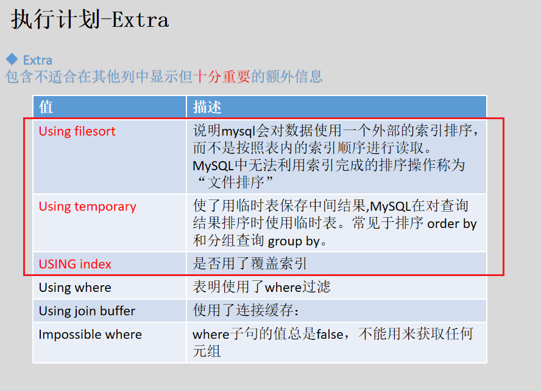
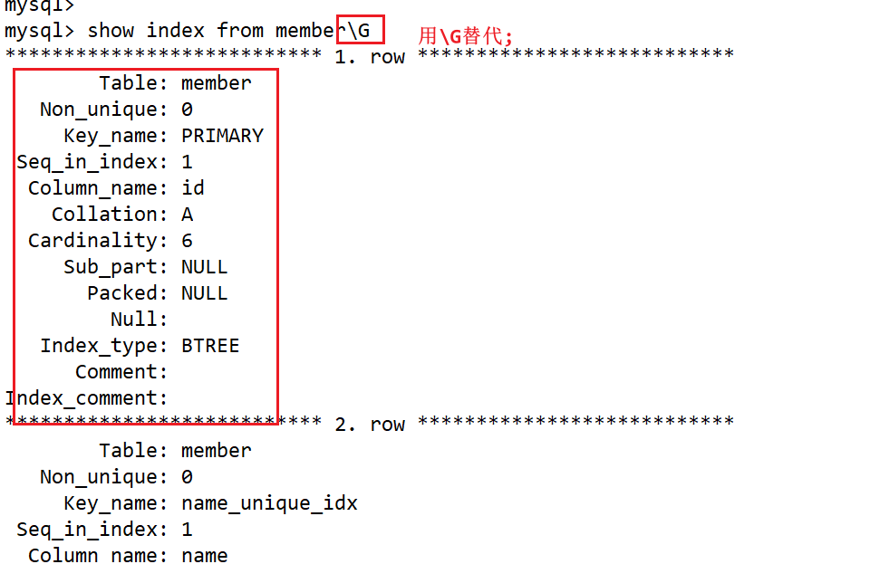

# MySQL

## 一. 事务

### 1. 概念

构成单一逻辑工作单元的操作集合（一组命令的集合）

### 2. 性质（ACID）(<u>*面试常考*</u>)

**原子性（Atomicity）**：原子性是指事务是一个不可分割的工作单位，事务中的操作要么都发生，要么都不发生。无论是操作系统崩溃，还是计算机停止运行，这项要求都要成立。

**一致性（Consistency）**：事务作为一个原子性操作，它从一个一致性的数据库状态开始运行，事务结束时，数据库的状态必须再次是一致的。

**隔离性（Isolation）**：尽管多个事务可能并发执行，但系统保证，对于任何一对事务Ti和Tj ,在Ti看来，Tj要么在Ti开始之前已经完成，要么在Ti完成之后才开始执行。因此，每个事务都感觉不到系统中有其他事务在并发地执行。事务是串行执行的，与后面的隔离级别有关。

**持久性（Durability）**：一个事务成功完成后，它对数据库的改变必须是永久的，即使出现系统故障。

### 3. 命令

**START** **TRANSACTION / BEGIN**：开启一个事务，标记事务的起点

**COMMIT**：提交事务，表示事务成功被执行。

**ROLL** **BACK**：回滚事务，回滚到初始状态或者回滚点。

**SAVEPOINT**：回滚点

**RELEASE SAVEPOINT**：删除回滚点

**SET TRANSACTION:** 设置隔离级别

```mysql
begin/start transaction

#提交事务（认为事务执行过程中的操作都）
commit

#事务异常断开的时候，事务可以体现原子性，认为事务中的操作都没有法身

rollback

#回滚点的设置
savepoint sp1; #sp1是回滚点的名字

#回到指定回滚点
rollback to sp1;

#查看数据库表的结构
show create table member;
desc member;


```

> #### 注意事项
>
> 1. START TRANSACTION 标志事务的开始，在 MySQL 中可以用 set autocommit = 0 替代。
>
> 2. 结束事务的情况只有两种：
>
> ​    a. COMMIT：表示事务成功被执行，结束事务。
>
> ​    b. 发生故障：结束事务, 不管有没有设置回滚点，都会回到事务开启前的状态。
>
> 3. ROLLBACK：不表示发生故障, 它也是一个数据库操作，属于事务的一部分。表示回滚事务，回滚到事务开启前的状态，或者中间的某个回滚点。要想 rollback 生效，必须要 commit。
>
> 
>
> #### 并发与并行
>
> 在同一时刻，只有一个线程可以运行，并发
>
> 在同一时刻，多个线程可以同时运行，并行


### 4. 并发执行事务可能会引发的问题

#### 脏写

是指当多个事务并发写同一数据时，**先执行的事务所写的数据会被后写的数据覆盖**。


#### 脏读

B事务读取A事务一个没有提交的中间值，所以对于B事务而言，就是脏读。


#### 不可重复读

一个事务有对同一个数据项的多次读取，但是在某前后两次读取之间，另一个事务**更新该数据项**，并且**提交**了。在后一次读取时，感知到了提交的更新。


#### 幻读

一个事务需要进行前后两次统计，在这两次统计期间，另一个事务插入了新的符合统计条件的记录，并且提交了。导致前后两次统计的数据不一致。这种现象，我们称之为幻读。

从这个事务的视角来看，平白无故多了几条数据。就像产生了幻觉一样。


### 5. 隔离级别

读未提交、读已提交、可重复读、可串行化。
隔离级别越来越高，说明串行能力越来越强，但是并发能力越来越弱。

默认为可重复读。

```mysql
#查看当前事务的隔离级别
select @@ [session|global] transaction_isolation;
select @@tx_isolation;

#查询当前隔离级别
select @@session.transaction_isolation;

#设置当前隔离级别为读未提交
set session transaction isolation level read uncommitted;

#设置当前隔离级别为读已提交
set session transaction isolation level read committed;

#设置当前隔离级别为可重复读
set session transaction isolation level repeatable read;

#设置当前隔离级别为可串行化
set session transaction isolation level serializable;
```

#### 1. 读未提交

可以避免脏写。

可以产生脏读，既然可以读一个没有提交的数据，不可重复读也是可以直接产生的（前后两次读操作是不一样）

可以产生幻读

#### 2. 读已提交

左右两边都开启事务，左右两边都进行select，此时数据是一致的。

在左边会话更新一条数据，右边会话也去更新同一条数据，发现卡死了（不能更新），**避免了脏写**。接着右边会话再去进行select操作，发现左边会话更新的数据看不到，所以**避免脏读**；接着左边会话执行提交操作，然后在右边会话进行select，发现左边会话更新的数据可以看到，所以对右边会话而言，就是不可重复读，就**产生了不可重复读**的现象。

左右两边都开启事务，右边进行读数据，在左边会话去插入一条数据，并且提交，右边会话在进行读，发现多产生了一条数据，对于右边会话而言，就是一个**幻读现象**。

#### 3. 可重复读

**不可以产生脏写、脏读、不可重复读**，但是**幻读是可以产生**的。

不是没有幻读，只是要通过插入失败来证明幻读。

#### 4. 可串行化

不允许并发执行写。


MySQL 支持4种隔离级别，默认为 RR (repeatable read)，MySQL的RR隔离级别，在一定程度上避免了幻读问题；

Oracle 只支持 read committed 和 serializable 两种隔离级别，默认为 read committed。

## 二、索引

### 1. 概念

索引(index)是帮助mySql高效获取数据的数据结构。

### 2. 索引使用的数据结构

顺序存储：需要大段连续的空间，时间复杂度O(N)

二分查找：时间复杂度O(logN) 需要大段连续的空间

二叉树查找：时间复杂度O(logN)，不需要连续的空间，树的高度是比较高的。此时将索引加载到内存，需要进行多次的磁盘IO，而磁盘IO的速度是比较慢的

哈希表：时间复杂度比较低O(1)， 不需要连续的空间，哈希会有哈希冲突，哈希不利于范围查找

B树（多叉平衡搜索树）：节点中需要存索引与value，还要存指针的大小，所以会在一定程度上限制一个节点中存放的索引的条数。会增加数的高度，从而增加磁盘IO的次数。

B+树：节点中不存放value值，在某种程度上可以将一个节点中的索引数目存储的更多，可以降低树的高度，从而减少磁盘IO的次数。

考虑的几个维度：时间复杂度、内存的要求（是不是需要连续空间）、磁盘IO的次数、范围查找

**一般情况下，索引底层使用的是B+树。**

```sql
#查看一个节点的大小
mysql> show variables like 'innodb_page_size';
+------------------+-------+
| Variable_name    | Value |
+------------------+-------+
| innodb_page_size | 16384 |
+------------------+-------+
1 row in set (0.04 sec)

mysql> 

```

### 3. B+树的特点

- 非叶子节点不存储data，只存储key
- 所有的叶子节点存储完整的一份key信息以及key对应的data
- 每一个父节点都出现在子节点中，是子节点的最大或者最小的元素
- 每个叶子节点都有一个指针，指向下一个节点，形成一个链表

数据是存在磁盘上面了，如果建立索引后，会产生索引树(B+)，也是存在磁盘上面，用索引进行查询的时候，需要将索引树加载到内存中，树的高度等同于磁盘IO的次数。

### 4. 索引的分类

主键索引：以主键建立的索引，称为主键索引

非主键索引：以非主键建立的索引，非主键索引。如唯一索引、普通索引、全文索引、组合索引

show variables like 'innodb_page_size'

### 5. 索引的创建

```sql
#查看表的索引
show index from member;
```

#### 主键的创建

特点：主键是唯一的，并且不能为空。

```sql
#创建表以及表的列（此时是没有主键）
mysql> create table test1 (id int, age int, name char(20));
Query OK, 0 rows affected (0.08 sec)

#再用alter给表创建主键
mysql> alter table test1 add primary key(id);
Query OK, 0 rows affected (0.06 sec)
Records: 0  Duplicates: 0  Warnings: 0

mysql>


#在创建表的同时，创建主键
mysql> create table test2 (id int, age int, name varchar(20), primary key(id));
Query OK, 0 rows affected (0.02 sec)

mysql> 
```

#### 唯一索引的创建

该列的值是唯一的，可以为空。

```sql
mysql> create unique index age_idx on test2(age);
Query OK, 0 rows affected (0.05 sec)
Records: 0  Duplicates: 0  Warnings: 0

mysql> 

#也可以使用alter的方法进行创建
```

#### 普通索引

该列没有什么特殊要求

```sql
mysql> create index age_idx on test2(age);
Query OK, 0 rows affected (0.05 sec)
Records: 0  Duplicates: 0  Warnings: 0

mysql> 

#也可以使用alter的方法进行创建
```

#### 组合索引

由多个列组成索引

```sql
mysql> create index name_math_idx on test3(name, math);
Query OK, 0 rows affected (0.06 sec)
Records: 0  Duplicates: 0  Warnings: 0

mysql>  show create table test3;
test3 | CREATE TABLE `test3` (
  `id` int(11) NOT NULL,
  `age` int(11) DEFAULT NULL,
  `name` varchar(20) DEFAULT NULL,
  `math` int(11) DEFAULT NULL,
  PRIMARY KEY (`id`),
  KEY `name_math_idx` (`name`,`math`)
) ENGINE=InnoDB DEFAULT CHARSET=latin1 |
+-------+----------------------------------------------------------------------------------------------------------------------------------------------------------------------------------------------------------------------------------------------------+
1 row in set (0.00 sec)

mysql> 
```

### 6. 索引的删除

```sql
#删除索引的方法1
ALTER TABLE table_name DROP INDEX index_name;
ALTER TABLE test3 DROP INDEX name_math_idx;

#删除索引的方法2
DORP INDEX IndexName ON TableName;
DORP INDEX name_math_idx ON test3;
```

### 7. 最左前缀

对于组合索引而言，查询的时候有可能用不到索引。每次进行查询的时候，在查询条件中需要把组合索引最左边的列带上，不然查询的时候就用不到索引。


### 8. 索引的好处与坏处

好处

提高数据检索的效率，降低数据库的IO成本

坏处

1、索引也会占用空间

2、更新索引也会花费时间

索引不是越多越好，要控制在合理范围。


## 三、逻辑架构

```sql
#查看数据库的版本
mysql> select version();
+-------------------------+
| version()               |
+-------------------------+
| 5.7.37-0ubuntu0.18.04.1 |
+-------------------------+
1 row in set (0.00 sec)

mysql> 

```

大体来说，MySQL可以分为 **Server 层和存储引擎层**。
Server 层包括连接器、查询缓存、解析器、优化器和执行器等，涵盖了 MySQL 大多数核心服务功能。

存储引擎层负责**数据的存储和提取**。其架构模式是插件式的，支持 InnoDB、MyISAM、Memory 等多个存储引擎。


## 四、存储引擎

存储引擎层负责**数据的存储和提取**,插件式的，即插即用

```sql
# 查看MySQL支持哪些存储引擎
SHOW ENGINES;

# 查看默认存储引擎
SHOW VARIABLES LIKE '%storage_engine%';

```

### MyISAM存储引擎

MySQL 5.5 之前默认的存储引擎。
特点：
   a. 查询速度很快
   b. **支持表锁**
   c. 支持全文索引(正排索引、倒排索引)
   d. **不支持事务**

粒度

使用 MyISAM 存储表，会生成三个文件.
.frm # 存储表结构，是任何存储引擎都有的
.myd # 存放数据
.myi # 存放索引

### InnoDB存储引擎

MySQL 5.5 以及以后版本默认的存储引擎。没有特殊应用，推荐使用InnoDB引擎。

特点：
   a. **支持事务**
   b. 支持**行锁**和表锁（默认支持行锁）
   c. 支持MVCC(多版本并发控制)
   d. 支持崩溃恢复
   e. **支持外键一致性约束**

使用 InnoDB 存储表，会生成两个文件.
.frm # 存储表结构，是任何存储引擎都有的
.ibd # 存放数据和索引


#### 从结构划分索引类型

索引和数据是分开存放的，这样的索引叫**非聚集索引**。MyISAM

索引和数据存放在一起，这样的索引叫**聚集索引**。InnoDB


### memory存储引擎

特点：
   a. 所有数据都存放在**内存**中，因此数据库重启后会丢失
   b. 支持表锁
   c. 支持Hash和BTree索引
   d. 不支持Blob（大的二进制信息）和Text（支持的是大文本）字段

### 存储引擎是memory表与临时表的区别

```sql
#临时表的创建
mysql> create temporary table test1 (id int, age int, name varchar(20), primary key(id));
Query OK, 0 rows affected (0.04 sec)

mysql>
#特点，创建完成之后，看不到表的名字；默认的存储引擎还是InnoDB;可以进行正常的SQL（insert、update、delete、select）；只会存在于当前会话，当会话关闭之后，临时表就消失了。


#存储引擎是memory的表
mysql> create table test2 (id int, age int, name varchar(20), primary key(id)) ENGINE=memory;

#存储引擎是memory的表，在创建之后，可以使用show tables看到表的名字；只是存储引擎被指定为memory；也是可以进行正常的SQL语句（insert、update、delete、select）的；关闭当前会话，存储引擎是memory可以进行正常的SQL操作；断电重启之后，存储引擎是memory中的数据丢失。
```

### Drop、delete、truncate的区别

drop可以删除数据库或者表，删除之后，数据库是不存在的，删除表的时候，会将表中内容与结构都删除。

delete只能删除表中的结构，删除的时候是一条条数据的删除。

truncate可以删除表中的数据，可以一次将数据与结构全部删除，然后再重新生成表以及表的结构，等价于执行truncate时，先执行drop再执行create。


### 外键

一个表A的某列是关联到另外一个表B的主键。


### 不同存储引擎的特征


## 三、锁机制

### 锁的分类

从对数据操作的**粒度**划分：（粒度可以看成是范围）
 表级锁：开销小，加锁快；不会出现死锁；锁定粒度大，发生锁冲突的概率最高，并发度最低。
行级锁：开销大，加锁慢；会出现死锁；锁定粒度最小，发生锁冲突的概率最低，并发度也最高。

从对数据操作的类型划分：
  读锁（共享锁）：同一份数据，多个读操作可以同时进行而互不影响。
  写锁（排它锁）：当前操作没有完成之前，它会阻断其他读锁和写锁。


### MyISAM的表锁

```sql
lock table 表名  read; (加读锁)
lock table 表名  write; (加写锁)
```

#### 1、读与读之间是共享的，但是读与写之间是不能同时存在的（对一张表加了读锁之前，其他的所有写操作都是不允许）


#### 2、某个会话，对某个表加了读锁之后，不允许该会话读其他的表。


如果想读其他的表，可以先将其他表进行锁定，然后在去进行读操作


#### 3、读与读之间的共享


#### 4、对某张表加了写锁之后


总结：读与读之间是属于共享的，不存在更改；但是写锁是属于排他的，不允许写与读或者写与写同时存在。

某个会话对某个表加了读锁之后，不允许该会话读其他的表。

如果想读其他的表，可以先将其他的表进行锁定，然后再去进行读操作

同一个会话可以对同一个表多次加读锁

不同会话可以对同一个表多次加读锁

```
show open tables; #查看锁被占用的情况
```

### InnoDB行锁

```sql
SELECT ... LOCK IN SHARE MODE;
SELECT ... FOR UPDATE;
```

innoDB是行级锁，每次锁的单位是行，所以不论对改行加读锁还是写锁，其他事务都是可以对其他行加读锁或者写锁，或者读其他行或者写其他行。


#### 间隙锁


原理：还是读锁与写锁之间是不能共存的，是排斥的。


## 四、业务设计

### 1. 逻辑设计

#### 范式设计

范式：设计数据库时的**规则**

第一范式：保证每一列都是原子的。

第二范式：确保表中的每一列都与主键相关。

第三范式：确保每列都和主键直接相关而不是间接相关。

#### 范式化设计的优缺点

优点：
 1）可以尽量得减少数据冗余
 2）范式化的表通常比反范式化的表更小
 3）范式化的数据库更新起来更加快；

不足：
1）范式化的表，在查询的时候经常需要很多join关联,增加让查询的代价。
2）更难进行索引优化

#### 反范式设计

允许存在**少量得冗余**，换句话来说反范式化就是使用**空间来换取时间**

反范式化设计的优缺点：

优点：
 1）可以减少表的关联
 2）可以更好的进行索引优化

缺点：
1）存在数据冗余及数据维护异常
2）对数据的修改需要更多的成本

范式设计与反范式设计没有绝对的，需要根据具体的需求进行选择，如果表的更新非常频繁的话，此时尽量满足范式设计，因为范式的表往往比较简单，更新起来比较容易；如果表更多的在与查询的时候，而不是更新，此时可以尽量满足反范式设计，减少连表查询的消耗。


### 2. 物理设计

命名规范、存储引擎选择、数据类型选择

#### 命名规范

**1**、数据库、表、字段的命名要遵守可读性原则

   例如：使用**custAddress**而不是**custaddress**来提高可读性。

**2**、数据库、表、字段的命名要遵守表意性原则

   对象的名字应该能够描述它所表示的对象

   例如：**name**表示姓名，**age**表示年龄

**3**、数据库、表、字段的命名要遵守长名原则

   尽可能少使用或者不使用缩写

#### 存储引擎选择

|              | **MyISAM**                             | **InnoDB**                                     |
| ------------ | -------------------------------------- | ---------------------------------------------- |
| 是否支持事务 | 否                                     | 是                                             |
| 是否支持外键 | 否                                     | 是                                             |
| 行锁和表锁   | 表锁，即使操作一条记录，也会锁住整个表 | 行锁和表锁，操作时只锁某一行，不对其他行有影响 |
| 缓存         | 只缓存索引，不缓存真实数据             | 不仅缓存索引，还要缓存真实数据                 |
| 表空间       | 小                                     | 大                                             |
| 关注点       | 性能                                   | 事务                                           |

可以根据以下的原则来选择 **MySQL** 存储引擎：如果要提供提交、回滚和恢复的事务安全（**ACID** 兼容）能力，并要求实现并发控制，**InnoDB** 是一个很好的选择。

如果数据表主要用来插入和查询记录，则 **MyISAM** 引擎提供较高的处理效率。

如果只是临时存放数据，数据量不大，并且不需要较高的数据安全性，可以选择将数据保存在内存的 **MEMORY** 引擎中，**MySQL** 中使用该引擎作为临时表，存放查询的中间结果。

提示：使用哪一种引擎要根据需要灵活选择，一个数据库中多个表可以使用不同的引擎以满足各种性能和实际需求。使用合适的存储引擎将会提高整个数据库的性能。

#### 数据类型

##### 当一个列可以选择多种数据类型时

1. 优先考虑数字类型
2. 其次是日期、时间类型
3. 最后是字符类型
4. 对于相同级别的数据类型，应该优先选择占用空间小的数据类型

##### 几个简单的原则

1. 更小的通常更好

2. 1. 一般情况下，应该尽量使用可以正确存储数据的最小数据类型。
   2. 更小的数据类型占用更少的空间，速度也更快。

3. 简单就好，简单数据类型的操作通常需要更少的CPU周期

4. 1. 比如：整形比字符操作代价更低。
   2. 用MySQL内建的类型而不是字符串来存储日期和时间。

5. 尽量避免NULL

6. 1. 可以为NULL是列的默认属性，通常情况下最好指定列为NOT NULL，除非真的需要存储NULL值。
   2. 如果查询中包含可为NULL的列，对MySQL来说更难优化，因为可以为NULL的列使得索引和值比较都更为复杂。
   3. 可以为NULL的列会使用更多的存储空间，在MySQL里也需要特殊处理。

 

## 五、索引2

主键索引：以主键作为的索引。

非主键索引（辅助索引）：不是以主键作为的索引，普通索引、唯一索引、全文索引、组合索引。

聚集索引（聚簇索引）：数据与索引是存在一起的，InnoDB为例，两个文件，frm 和ibd

非聚集索引（非聚簇索引）：数据与索引是分开存放的，MyISAM为例，三个文件frm、myd、myi

如果是InnoDB，再去以主键或者非主键创建索引。

如果**存储引擎是InnoDB的表**，并且是以主键创建的索引树，就会在叶子结点下面存放该条数据的完整信息。

如果是以非主键创建的索引树，就会在叶子结点下面存放对应主键索引，就不会将该条数据的完整信息全部存在辅助索引树上。

如果**存储引擎是MyISAM的表**，不管是以主键创建的主键索引树还是以非主键创建的索引树，在叶子结点里面存放的都是该条数据对应的地址值。

对于InnoDB存储引擎而言，如果在辅助索引树上进行查找某些列，并且在辅助索引树上找到了该列，那么就是称为**索引覆盖**；如果在辅助索引树上查找某些列A、B，这些列在辅助索引树上找不到，此时可以在辅助索引树上找到对应的主键，然后通过主键索引树找到那些列A、B，这称为**回表**。

```sql
id(primary key)   age  name   phone  address      #InnoDB

#创建辅助索引    age（index）      name（index）
#age（index）辅助索引树 叶子结点下会存主键id
select name from member where  age = 10;;  #回表
select address from member where  age = 10;;  #回表,辅助索引树，主键索引树
select address from member where age = 10;  #回表,辅助索引树，主键索引树
select * from member where age = 10;  #回表,辅助索引树，主键索引树
select age from member where  age = 10;; #索引覆盖
select id from member where  age = 10;; #索引覆盖
select age,id from member where  age = 10;; #索引覆盖

#name（index）辅助索引树 叶子结点下会存主键id
select name from member where  name = 'wangdao';  #索引覆盖
select id from member where  name = 'wangdao';  #索引覆盖
select name,id from member where  name = 'wangdao';  #索引覆盖
select age from member where  name = 'wangdao';  #回表
select phone from member where  name = 'wangdao';  #回表
select phone,id from member where  name = 'wangdao';  #回表
```

## 六、慢查询日记

就是记录了查询比较慢（执行时间长）的SQL的日志。

```sql
#查询慢查询日志的时间
mysql> show variables like 'long_query_time';
+-----------------+-----------+
| Variable_name   | Value     |
+-----------------+-----------+
| long_query_time | 10.000000 |
+-----------------+-----------+
1 row in set (0.00 sec)

#查询慢查询日志的相关信息（慢查询日志的开关、对应的文件名字与路径）
mysql> show variables like '%slow%';
+---------------------------+---------------------------------+
| Variable_name             | Value                           |
+---------------------------+---------------------------------+
| log_slow_admin_statements | OFF                             |
| log_slow_slave_statements | OFF                             |
| slow_launch_time          | 2                               |
| slow_query_log            | OFF                             |
| slow_query_log_file       | /var/lib/mysql/wangdao-slow.log |
+---------------------------+---------------------------------+
5 rows in set (0.00 sec)

ERROR: 
No query specified

常用命令
Show variables like “%slow_query_log”;
Set global slow_query_log=1;  #只是临时生效，如果要永久生效，必须修改配置文件
show variables like "%long_query%";  
Set global long_query_time=0.1;  #为什么修改之后看不到变化？ 
需要重新连接或者show global variables like ‘long_query%’
可以select sleep(1);
Show global status like ‘%slow_queries’;  #查看慢查询SQL记录数

常用配置
slow_query_log 启动/停止技术慢查询日志
slow_query_log_file 指定慢查询日志得存储路径及文件（默认和数据文件放一起）
long_query_time 指定记录慢查询日志SQL执行时间的阈值（单位：秒，默认10秒）
log_queries_not_using_indexes  是否记录未使用索引的SQL
log_output 日志存放的地方【TABLE】【FILE】【FILE,TABLE】

记录符合条件得SQL
查询语句
数据修改语句
已经回滚得SQL     

```

## 七、执行计划

可以查看官方文档：

mysql.com->DOCUMENTATION->MySQL 5.7 Reference Manual->Optimization->Understanding the Query Execution Plan ->EXPLAIN Output Format


可以使用explain + SQL语句。


#### 1、id列

从id的大小，可以判别那张表先执行，那张表后执行，间接可以推测出SQL的执行顺序。

规则：当id相同的时候，从上向下依次执行；当id不同的时候，先执行id大的对应的表，然后在执行id小的对应的表；当id既有相同也有不同的时候，先执行id大的对应的表，然后在id相同情况下，从上往下执行。


#### 2、select_type


#### 3、type列（最重要）

用到索引的类型与等级

system > const > eq_ref > ref > range > index > ALL


总结：

system 最快：不进行磁盘 IO
const：PK 或者 unique 上的等值查询
eq_ref：PK 或者 unique 上的 join 查询，等值匹配，对于前表的每一行，后表只有一行命中
ref：非唯一索引，等值匹配，可能有多行命中
range：索引上的范围扫描，例如：between、in、>
index：索引上的全集扫描，例如：InnoDB 的 count
ALL 最慢：全表扫描

#### 4、possible_keys、key、ken_len

possible_keys：可能用到的索引
key：实际用到的索引
ken_len：用到索引的最大可能长度

每个字符占用的字节：utf8mb4=4,utf8=3,gbk=2,latin1=1

varchar会额外占用两个字节大小，NULL会额外占用一个字节大小。

**key_len = n *(utf8mb4=4,utf8=3,gbk=2,latin1=1) + 1(NULL)/0(not NULL) + 2（varchar）/0(char)**

 **datetime类型在5.6中字段长度是5个字节，datetime类型在5.5中字段长度是8个字节**

查看当前表是属于哪个数据库

```sql
mysql> select database();
+------------+
| database() |
+------------+
| wangdao    |
+------------+
1 row in set (0.00 sec)

mysql> 
```

#### 5、extra





### 六、索引失效

```sql
insert into student values (6, '19',34, '19', '19', '19', '2015-02-12 10:10:00');

show create table student;
#索引优化
#1、不在索引列上做任何操作（计算，函数等等），会导致索引失效
explain select * from student where id = 3;
explain select * from student where id + 1 = 4;

#2、慎用不等于号，会使索引失效
show create table student;
explain select * from student where c1 =  'wuhan';
explain select * from student where c1 <> 'wuhan';#回表
explain select c1 from student where c1 <> 'wuhan';
explain select c1,c2 from student where c1 <> 'wuhan';

explain select * from student where c1 > 'wuhan' or c1 < 'wuhan';
explain select c1 from student where c1 > 'wuhan' or c1 < 'wuhan';
explain select c1 from student where c1 > 'wuhan' UNION 
 select c1 from student where c1 < 'wuhan';

#3、存储引擎不能使用索引中范围条件右边的列
explain  select * from student where c1 = 'wuhan' and c2 > 'c' and c3 = 'wangdao';
explain  select * from student where c1 = 'wuhan' and c2 like 'c%' and c3 = 'wangdao';

#4. 只访问索引的查询：索引列和查询列一致，尽量用覆盖索引，减少select *
explain  select * from student where c2 = 'wuhan';

explain  select c1,c2 from student where c2 ='wuhan'; 

#5. NULL/NOT NULL的可能影响


#6. 字符串类型加引号，不加引号会索引失效
explain  select * from student where c1 = '19';
explain  select * from student where c1 = 19;

#7. UNION的效率比or更好
explain select * from student where c1 = '19';
explain select * from student where c1 = 'wuhan';
explain select * from student where c1 = '19' or c1 = 'wuhan';
explain select * from student where c1 = '19' union select * from student where c1 = 'wuhan';
```

## 主从复制

定义：将一台MySQL服务器上的数据复制到一台或多台服务器上。（主服务器-从服务器）

主机：dump线程、binlog日志

从机：IO线程、SQL线程、RelayLog

