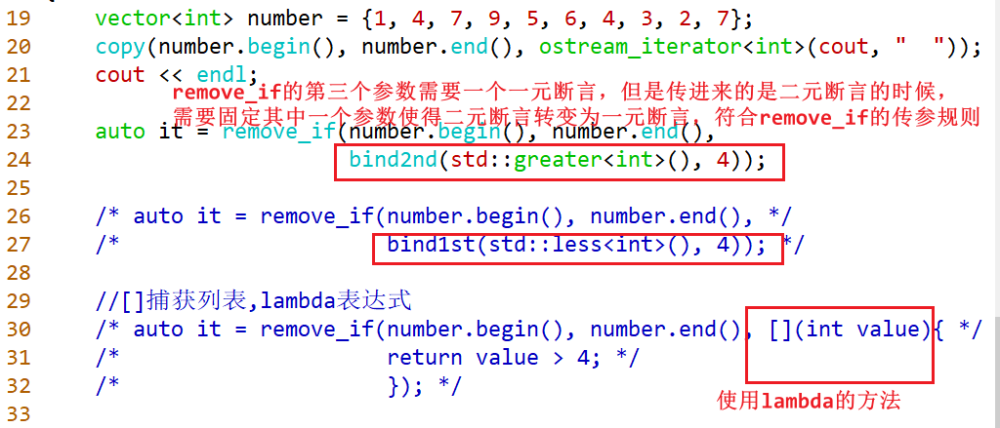
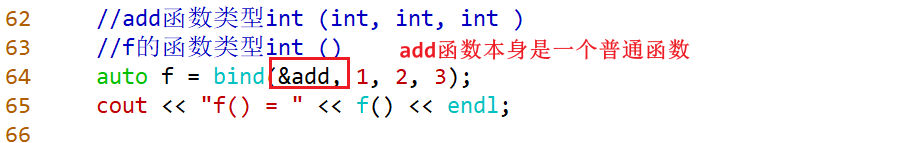
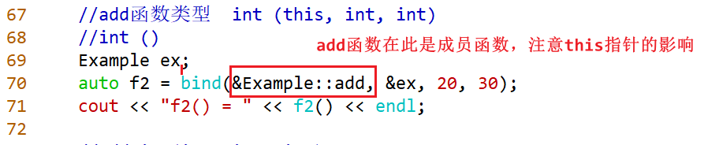
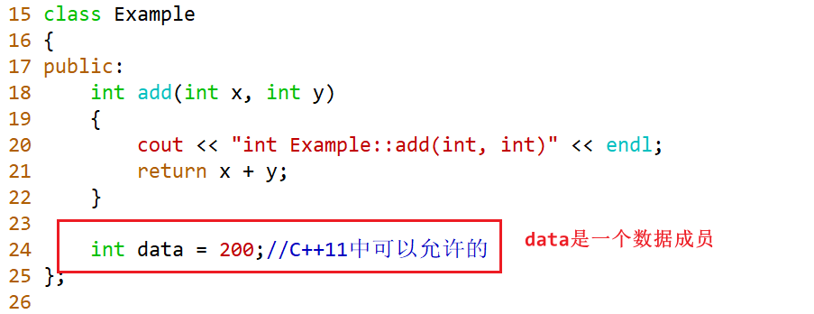
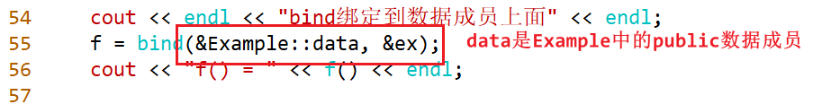
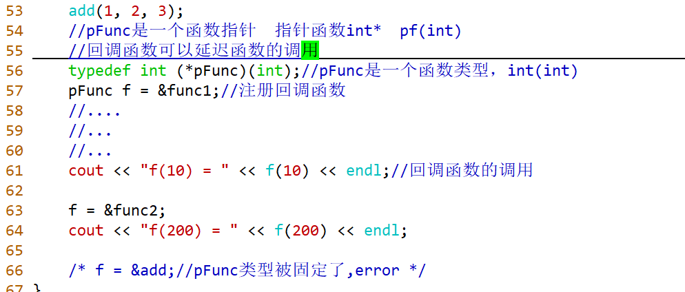
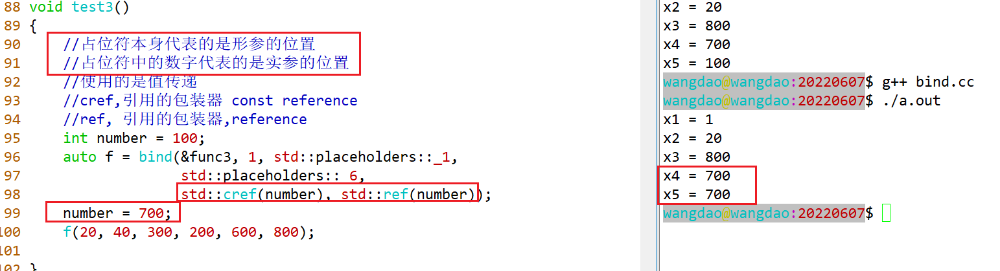
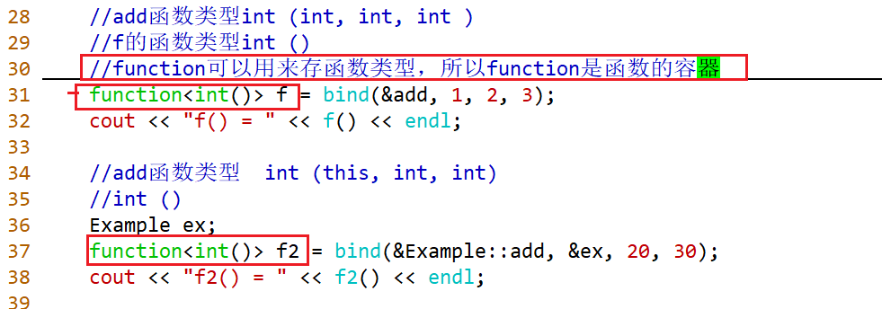
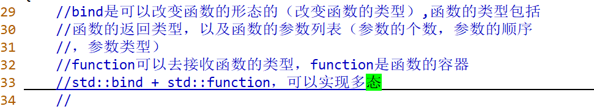
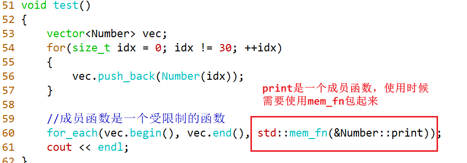

# 函数指针

## 定义

### 写法

```cc
using pFunc = (*pFunc)(int); //pFunc是一个函数类型，int(int)
typedef int (*pFunc)(int); //pFunc是一个函数类型，int(int)
pFunc f = &func1;

int (*pFunc)(int, int) = nullptr; //pFunc是一个函数指针
pFunc = add;
printf("%d\n", pFunc(1, 2));    // 1)
printf("%d\n", (*pFunc)(1, 2)); // 2)int (*pFunc)(int a, int b) = nullptr;
```

## 用法

### bind

#### bind1st、bind2nd

```
//可以绑定二元函数对象f的第一个参数，使得二元函数变成一元函数，并固定第一个参数
template< class F, class T >
std::binder1st<F> bind1st( const F& f, const T& x );


bind1st(f, 4);
f(4, y)
remove_if(number.begin(), number.end(), 一元断言/谓词);
bool func(int value)
{
    return value > 4;
}

remove_if(number.begin(), number.end(), bind1st(std::less<int>(), 4))
struct less
{
    bool operator()(const int &num1 = 4, const int &num2)
    {
        return 4 < num2;
    }
}

//可以绑定二元函数对象f的第二个参数，使得二元函数变成一元函数，并固定第二个参数
template< class F, class T >
std::binder2nd<F> bind2nd( const F& f, const T& x );
```

#### bind



```C++
Defined in header <functional>
template< class F, class... Args >
/*unspecified*/ bind( F&& f, Args&&... args );

template< class R, class F, class... Args >
/*unspecified*/ bind( F&& f, Args&&... args );

```

**bind可以绑定到n元函数，该函数可以是自由函数、全局函数（非成员函数），也可以绑定到成员函数，甚至可以绑定的数据成员上。**












#### 占位符的概念




> std::bind的实现原理阅读材料
>
> ```C++
> http://www.cnblogs.com/xusd-null/p/3698969.html
> https://www.tuicool.com/articles/iMZ7ba
> ```


### function

```cc
Defined in header <functional>
template< class >
class function; /* undefined */

template< class R, class... Args >
class function<R(Args...)>;

function<类型>  f;
function<int(int, int, int)> f;//function也是容器，可以传某种类型的数据

template<class T, class Allocator = std::allocator<T>> 
class vector;

vector<int> number;//vector属于容器，可以存任何类型的数据
```



#### bind与function的结合使用的优势

使用的是基于对象的思想（没有使用继承）



```

```


### mem_fn

成员函数绑定器

```C++
int (*pFunc)(int, int);
//普通函数
int add(int x, int y)
{
        
}
class Test
{
    public:
    int add(int x, int y)
    {
        
    }
}

//非静态的成员函数，都会在第一个参数的位置隐藏一个this
//成员函数指针
int (Test::*pFunc)(int, int);//解决this指针的问题
pFunc = &Test::add;

template< class M, class T >
/*unspecified*/ mem_fn(M T::* pm);

//全局作用域
int add(int, int)
{
}

int add(int, int，int)
{
}

//在C语言中，函数名字是函数的入口地址，C语言是不支持函数重载的
add;

//在C++中因为存在函数重载，要找到函数，可以使用函数进行取地址&add;C++是兼容C语言,所以普通函数的函数名就是函数的入口地址，但是C++中成员函数的函数名字就不是函数的入口地址。
```



## 回调函数

回调函数：将一个函数指针以参数的形式传递给另一个函数

注册回调函数：把传入的函数指针赋给成员（函数指针或者是函数容器）

执行回调函数：通过这个成员执行函数

### 案例

```cc
#include <math.h>
#include <functional>
#include <iostream>

using std::bind;
using std::cout;
using std::endl;
using std::function;

//抽象类作为接口使用的例子可以实现多态
//
//面向对象的设计原则：开闭原则对扩展开放，对修改关闭
//
//使用std::bind + std::function实现多态,基于对象的方法(没有使用继承)
//
class Figure {
public:
    //重定义
    using DisplayCallback = function<void()>;
    using AreaCallback = function<double()>;

    DisplayCallback _displayCallback;
    AreaCallback _areaCallback;

    /* virtual void display() = 0; */
    /* virtual double area() = 0; */

    //注册回调函数
    /* void setDisplayCallback(function<void()> &&cb) */
    void setDisplayCallback(DisplayCallback&& cb) {
        _displayCallback = std::move(cb);
    }

    void setAreaCallback(AreaCallback&& cb) {
        _areaCallback = std::move(cb);
    }

    //执行回调函数
    void handleDisplayCallback() const {
        if (_displayCallback) {
            _displayCallback();
        }
    }

    double handleAreaCallback() const {
        if (_areaCallback) {
            return _areaCallback();
        } else {
            return 0;
        }
    }
};

class Rectangle {
public:
    Rectangle(double length = 0, double width = 0)
        : _length(length), _width(width) {
    }

    void display() {
        cout << "Rectangle";
    }

    double area() {
        return _length * _width;
    }

private:
    double _length;
    double _width;
};

class Circle {
public:
    Circle(double radius = 0)
        : _radius(radius) {
    }

    void show() {
        cout << "Circle";
    }

    double showArea() {
        return 3.14 * _radius * _radius;
        ;
    }

private:
    double _radius;
};

class Triangle {
public:
    Triangle(double a = 0, double b = 0, double c = 0)
        : _a(a), _b(b), _c(c) {
    }

    void print(int x) {
        cout << "Triangle";
    }

    double printArea() {
        double tmp = (_a + _b + _c) / 2;
        return sqrt(tmp * (tmp - _a) * (tmp - _b) * (tmp - _c));
    }

private:
    double _a;
    double _b;
    double _c;
};

void func(const Figure& pfig) {
    //执行回调函数
    pfig.handleDisplayCallback();
    cout << "的面积 : " << pfig.handleAreaCallback() << endl;
}

int main(int argc, char** argv) {
    Rectangle rectangle(10, 20);
    Circle circle(10);
    Triangle triangle(3, 4, 5);

    Figure fig;
    //回调函数的注册
    fig.setDisplayCallback(bind(&Rectangle::display, &rectangle));
    fig.setAreaCallback(bind(&Rectangle::area, &rectangle));
    func(fig);

    fig.setDisplayCallback(bind(&Circle::show, &circle));
    fig.setAreaCallback(bind(&Circle::showArea, &circle));
    func(fig);

    fig.setDisplayCallback(bind(&Triangle::print, &triangle, 3));
    fig.setAreaCallback(bind(&Triangle::printArea, &triangle));
    func(fig);

    return 0;
}
```


