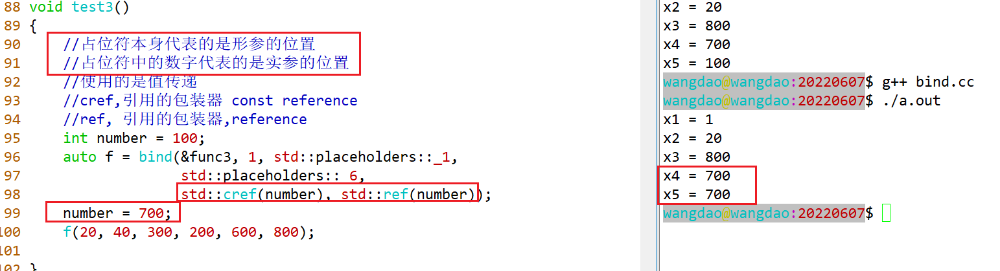

# 算法

## 类型

1、非修改式的算法  count、find、find_xxx、**for_each**

2、修改式的算法  **copy**、remove、**remove_if**、unique、fill

3、排序算法  **sort**以及sort相关、lower_bound、upper_bound、binary_search

4、集合操作  **set_intersection**

5、heap的操作  make_heap、push_heap、pop_heap

6、最大值与最小值 min、max

7、比较函数  equal

8、当空间的申请与对象的构建分开的时候，可以**uninitialized_copy**未初始化拷贝操作，uninitialized_xxx


## 函数类型

一元函数（UnaryFunction）：函数的参数只有一个。

一元断言/一元谓词（UnaryPredicate）：函数的参数只有一个，并且函数的返回类型是bool。

二元函数：函数的参数有两个。

n元函数：函数的参数有n个。

```C++
 void print(int value)
 {
     cout << value << "  ";
 }

vector<int> number = {1, 6, 8, 4, 2, 7, 9};
for_each(number.begin(), number.end(), print);


template <class _InputIter, class _Function>
_Function for_each(_InputIter __first, _InputIter __last, _Function __f) 
{
  
  for ( ; __first != __last; ++__first)
    __f(*__first);//print(*__first)
  return __f;
}
                    __last
1, 6, 8, 4, 2, 7, 9
                     f
```


## remove_if

```c++
bool func(int value)
{
    return value > 4;
}

remove_if(number.begin(), number.end(), func);

first = number.begin();
last = number.end();
p = func;

//源码——————————————————————————————————————————————————————
//find_if
template<class InputIt, class UnaryPredicate>
constexpr InputIt find_if(InputIt first, InputIt last, UnaryPredicate p)
{
    for (; first != last; ++first) {
        if (p(*first)) {
            return first;
        }
    }
    return last;
}
1  4  7  9  5  6  4  3  2  7
      f
//—————————————————————————————————————————————————————

bool func(int value)
{
    return value > 4;
}

//源码——————————————————————————————————————————————————————
//remove_if

template<class ForwardIt, class UnaryPredicate>
ForwardIt remove_if(ForwardIt first, ForwardIt last, UnaryPredicate p)
{
    first = std::find_if(first, last, p);
    if (first != last)
    {
         for(ForwardIt i = first; ++i != last; )
         {
              if (!p(*i))
              {
                  //*first++ = std::move(*i);
                  *first = *i;
                  first++;
              }               
         }         
    }
       
    return first;
}
               f              last
1  4  4  3  2  6  4  3  2  7
                             i
                   
        1, 4, 7, 9, 5, 6, 4, 3, 2, 7
vector  1  4  9, 6, 4, 3, 2
list    1  4  4   3  2 
```


**STL算法库中的算法属于通用算法，不是针对于某一种具体容器去进行设计，所有的容器都可以直接使用。这就是通用编程，或者称为泛型编程的思想。**


## bind

```cc
remove_if(number.begin(), number.end(), 一元断言/谓词);
bool func(int value)
{
    return value > 4;
}

remove_if(number.begin(), number.end(), 二元断言/谓词);
bool func(int num1, int num2)
{
    return value > 4;
}

remove_if(number.begin(), number.end(), 一元断言/谓词);
bool func2(int num1, int num2 = 4)
{
    return num1 > num2;
}

func2(10);

struct greater
{
    bool operator()(const int &num1, const int &num2 = 4)
    {
        return num1 > 4;
    }
}
```

```cc
//可以绑定二元函数对象f的第一个参数，使得二元函数变成一元函数，并固定第一个参数
template< class F, class T >
std::binder1st<F> bind1st( const F& f, const T& x );


bind1st(f, 4);
f(4, y)
remove_if(number.begin(), number.end(), 一元断言/谓词);
bool func(int value)
{
    return value > 4;
}

remove_if(number.begin(), number.end(), bind1st(std::less<int>(), 4))
struct less
{
    bool operator()(const int &num1 = 4, const int &num2)
    {
        return 4 < num2;
    }
}

//可以绑定二元函数对象f的第二个参数，使得二元函数变成一元函数，并固定第二个参数
template< class F, class T >
std::binder2nd<F> bind2nd( const F& f, const T& x );
```


### bind的使用

```cc
Defined in header <functional>
template< class F, class... Args >
/*unspecified*/ bind( F&& f, Args&&... args );

template< class R, class F, class... Args >
/*unspecified*/ bind( F&& f, Args&&... args );
```

**bind可以绑定到n元函数，该函数可以是自由函数、全局函数（非成员函数），也可以绑定到成员函数，甚至可以绑定的数据成员上。**


#### 占位符的概念



### 四、function的使用

```C++
Defined in header <functional>
template< class >
class function; /* undefined */

template< class R, class... Args >
class function<R(Args...)>;

function<类型>  f;
function<int(int, int, int)> f;//function也是容器，可以传某种类型的数据

template<class T, class Allocator = std::allocator<T>> 
class vector;

vector<int> number;//vector属于容器，可以存任何类型的数据
```


#### bind与function的结合使用的优势

使用的是基于对象的思想（没有使用继承）


```cc
#include <math.h>
#include <functional>
#include <iostream>

using std::bind;
using std::cout;
using std::endl;
using std::function;

//抽象类作为接口使用的例子可以实现多态
//
//面向对象的设计原则：开闭原则对扩展开放，对修改关闭
//
//使用std::bind + std::function实现多态,基于对象的方法(没有使用继承)
//
class Figure {
public:
    //重定义
    using DisplayCallback = function<void()>;
    using AreaCallback = function<double()>;

    DisplayCallback _displayCallback;
    AreaCallback _areaCallback;

    /* virtual void display() = 0; */
    /* virtual double area() = 0; */

    //注册回调函数
    /* void setDisplayCallback(function<void()> &&cb) */
    void setDisplayCallback(DisplayCallback&& cb) {
        _displayCallback = std::move(cb);
    }

    void setAreaCallback(AreaCallback&& cb) {
        _areaCallback = std::move(cb);
    }

    //执行回调函数
    void handleDisplayCallback() const {
        if (_displayCallback) {
            _displayCallback();
        }
    }

    double handleAreaCallback() const {
        if (_areaCallback) {
            return _areaCallback();
        } else {
            return 0;
        }
    }
};

class Rectangle {
public:
    Rectangle(double length = 0, double width = 0)
        : _length(length), _width(width) {
    }

    void display() {
        cout << "Rectangle";
    }

    double area() {
        return _length * _width;
    }

private:
    double _length;
    double _width;
};

class Circle {
public:
    Circle(double radius = 0)
        : _radius(radius) {
    }

    void show() {
        cout << "Circle";
    }

    double showArea() {
        return 3.14 * _radius * _radius;
        ;
    }

private:
    double _radius;
};

class Triangle {
public:
    Triangle(double a = 0, double b = 0, double c = 0)
        : _a(a), _b(b), _c(c) {
    }

    void print(int x) {
        cout << "Triangle";
    }

    double printArea() {
        double tmp = (_a + _b + _c) / 2;
        return sqrt(tmp * (tmp - _a) * (tmp - _b) * (tmp - _c));
    }

private:
    double _a;
    double _b;
    double _c;
};

void func(const Figure& pfig) {
    //执行回调函数
    pfig.handleDisplayCallback();
    cout << "的面积 : " << pfig.handleAreaCallback() << endl;
}

int main(int argc, char** argv) {
    Rectangle rectangle(10, 20);
    Circle circle(10);
    Triangle triangle(3, 4, 5);

    Figure fig;
    //回调函数的注册
    fig.setDisplayCallback(bind(&Rectangle::display, &rectangle));
    fig.setAreaCallback(bind(&Rectangle::area, &rectangle));
    func(fig);

    fig.setDisplayCallback(bind(&Circle::show, &circle));
    fig.setAreaCallback(bind(&Circle::showArea, &circle));
    func(fig);

    fig.setDisplayCallback(bind(&Triangle::print, &triangle, 3));
    fig.setAreaCallback(bind(&Triangle::printArea, &triangle));
    func(fig);

    return 0;
}
```

### 五、mem_fn的使用

成员函数绑定器

```C++
int (*pFunc)(int, int);
//普通函数
int add(int x, int y)
{
        
}
class Test
{
    public:
    int add(int x, int y)
    {
        
    }
}

//非静态的成员函数，都会在第一个参数的位置隐藏一个this
//成员函数指针
int (Test::*pFunc)(int, int);//解决this指针的问题
pFunc = &Test::add;

template< class M, class T >
/*unspecified*/ mem_fn(M T::* pm);

//全局作用域
int add(int, int)
{
}

int add(int, int，int)
{
}

//在C语言中，函数名字是函数的入口地址，C语言是不支持函数重载的
add;

//在C++中因为存在函数重载，要找到函数，可以使用函数进行取地址&add;C++是兼容C语言,所以普通函数的函数名就是函数的入口地址，但是C++中成员函数的函数名字就不是函数的入口地址。
```

```
for_each(vec.begin(), vec.end(), bind(&Number::print, _1));
for_each(vec.begin(), vec.end(), mem_fn(&Number::print));
```


##### 成员函数指针

```cc
class Test
{
public:
    int add(int x, int y)
    {
        return x + y;
    }
};

void test()
{
    typedef int (*pFunc)(int, int);
    /* pFunc f = &Test::add;//error，类型不匹配 */

    Test tst;
    typedef int (Test::*pFunc2)(int, int);
    pFunc2 f2 = &Test::add;
    /* f2(1, 2);//error */
    (tst.*f2)(1, 2);//成员函数指针的使用
    Test *pt = new Test();
    (pt->*f2)(1, 2);//成员函数指针的使用
    pt->add(1, 2);
}
```
