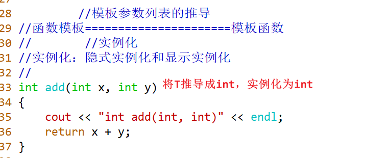
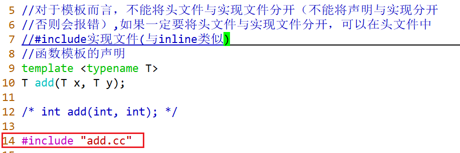
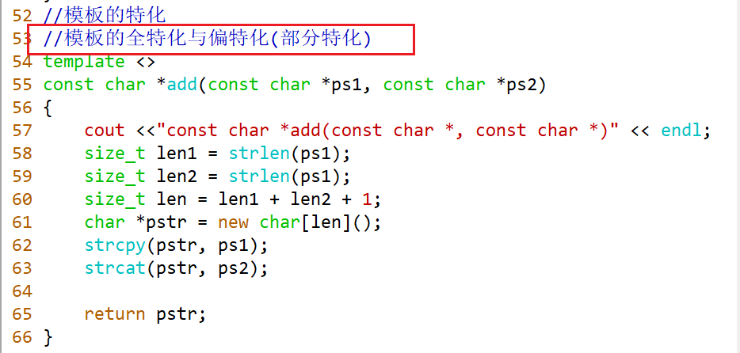
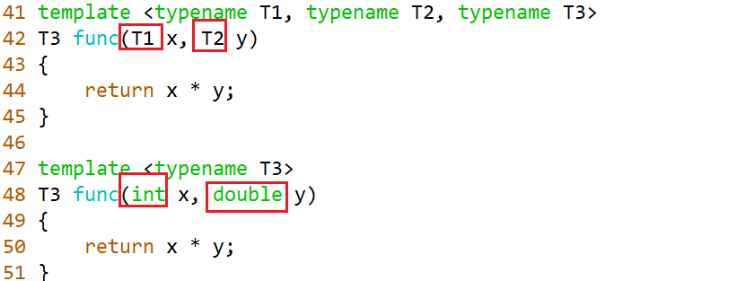
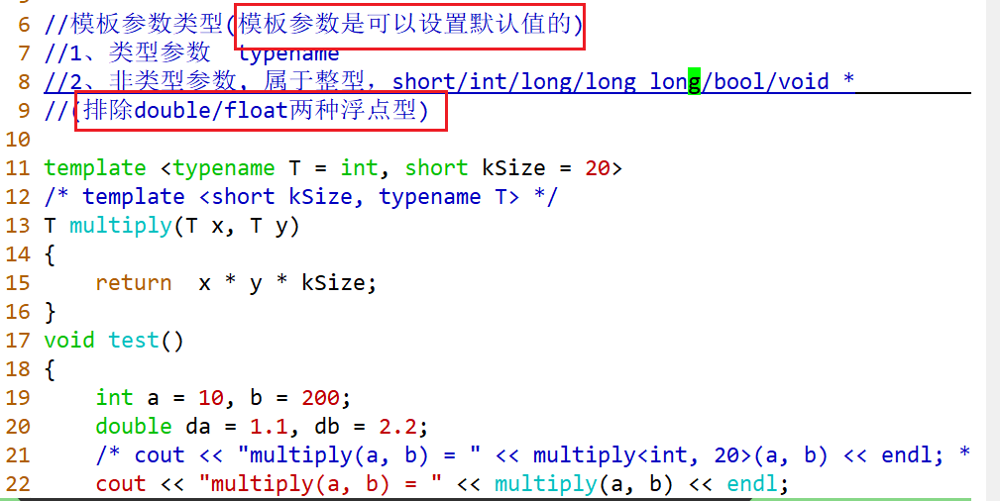
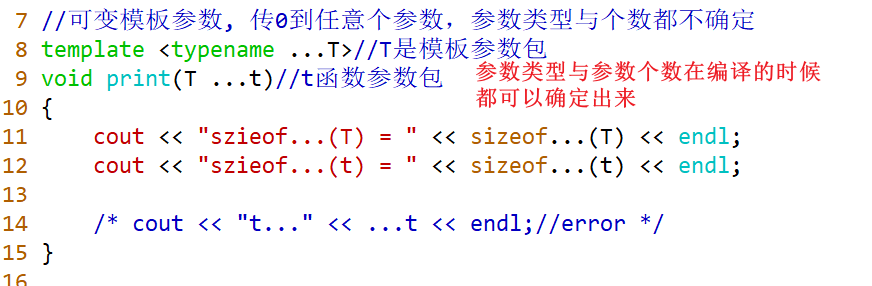
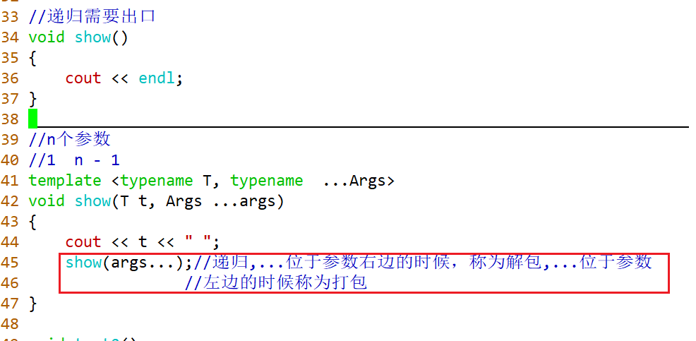

### 一、模板

#### 为什么要定义模板？

1. 简化代码、少写代码
2. 可以解决严格性与灵活性的冲突

> 强类型语言：C/C++/Java，int a = 10;有严格类型要求，auto a = 10;
>
> 弱类型语言：js/py  ,   var a = 10

#### 形式

```cc
//例子：函数模板
template <模板参数列表>
函数的返回类型   函数名字(函数的参数列表)
{
}


template <typename T1, typename T2，...>
template <class T1, class T2，...>
//模板参数列表中typename与class的含义是完全一样
```

#### 模板的类型

函数模板、类模板


#### 函数模板

```C++
template <typename T>
T add(T x, T y)
{}
```

普通函数可以与函数模板进行重载，
普通函数优先于函数模板的执行，
函数模板与函数模板之间也是可以进行重载的。



对于模板而言，不能将头文件与实现文件分开（不能将声明与实现分开否则会报错），如果一定要将头文件与实现文件分开，可以在头文件中#include实现文件(与inline类似）。

以string的实现为例，头文件中包含.tcc文件。





全特化：将模板的参数列表中的参数全部以特殊版本的形式写出来；

偏特化（部分特化）：将模板参数列表中的参数类型，至少有一个没有特化出来。



#### 模板的参数类型



#### 成员函数模板

成员函数可以设置为模板形式，有两个要求任选其一。


#### 类模板

```C++
template <typename T>
class Stack
{
 private:
    T *_data;
};
```

##### 类外定义的写法

```cc
template <typename T, size_t kSize = 10>
class Stack
{
public:
    ~Stack();
};

template <typename T, size_t kSize>
Stack<T, kSize>::~Stack()
{ }

//静态变量初始化
private:
    static T* _pInstance;
    static AutoRelease _ar;

...
    
template <typename T>
T* Singleton<T>::_pInstance = nullptr;

template <typename T>
typename Singleton<T>::AutoRelease Singleton<T>::_ar;

```

> ##### 带有默认参数值的模板类成员不能在类外进行定义
>
> ```cc
> template <typename T>
> class A {
>     void fun(int a = 0);
> };
> 
> template<typename T>
> void A<T>::fun(int a = 0) {
>     /*
>     */
> }
> ```
>
> 对于类似上文代码，编译器会报 “an out-of-line definition of a member of a class template cannot have default arguments”错误。
>
> 修改方式有两种。
>
> 第一种在类内进行定义：
>
> ```cc
> template <typename T>
> class A {
>     void fun(int a = 0){
>        /*
>       */
>     }
> };
> ```
>
> 第二种在类外进行定义时，将默认值去掉：
>
> ```cc
> template <typename T>
> class A {
>     void fun(int a = 0);
> };
> 
> template<typename T>
> void A<T>::fun(int a /*= 0*/) {
>     /*
>     */
> }
> ```

#### 可变模板参数

```C++
template <typename ...Args>//Args模板参数包
void func(Args ...args)//args函数参数包
{
    
}

template <typename T1, typename T2, typename T3,...>
void func(T1 t1, T2 t2, T3 t3,...)
{
    
}
```

> 实现一个模板形式的单例类，要求对于任意类型的类经过Singleton的处理之后，都能获取一个单例对象，并且可以传递任意参数（传递任意参数就是要用到可变模板参数）
>
> ```C++
> class Point;
> class Computer;
> 
> Point pt(1, 2);
> Point pt2(3, 4);
> 
> Computer com("Mac", 8888);
> 
> int main(void)
> {
>     Computer *pc1 = Singleton<Computer>::getInstance("Xiaomi", 6666);
>     Computer *pc2 = Singleton<Computer>::getInstance("Xiaomi", 6666);
>     
>     Point　*pt3 = Singleton<Point>::getInstance(1, 2);
>     Point　*pt4 = Singleton<Point>::getInstance(1, 2);
>     
>     return 0;
> } 
> ```
>
> ```cc
> #include <iostream>
> #include <string>
> 
> using std::cout;
> using std::endl;
> using std::string;
> 
> class Point {
> public:
>     Point()
>     : _x(0), _y(0) {}
> 
>     Point(int x, int y)
>     : _x(x), _y(y) {}
> 
>     double getX() const { return _x; }
> 
>     double getY() const { return _y; }
> 
>     void show() const {
>         cout << "(" << getX() << ", " << getY() << ")" << endl;
>     }
> 
>     void setPoint(int x, int y){
>         _x = x;
>         _y = y;
>     }
> 
>     ~Point() { cout << "~Point()" << endl; }
> 
> private:
>     double _x, _y;
> };
> 
> class Computer {
> public:
>     Computer()
>     : _brand("none"), _price(0) {}
> 
>     Computer(const string& brand, int price)
>     : _brand(brand), _price(price) {}
> 
>     string getBrand() const {
>         return _brand;
>     }
> 
>     int getPrice() const {
>         return _price;
>     }
> 
>     void show() const {
>         cout << "brand:" << getBrand() << " price: " << getPrice() << endl;
>     }
> 
>     void setBrand(const string& brand) { _brand = brand; }
>     void setPrice(int price) { _price = price; }
> 
>     ~Computer() { cout << "~Computer()" << endl; }
> 
> private:
>     string _brand;
>     int _price;
> };
> 
> template <typename T>
> class Singleton {
> public:
>     template<typename ...Args>
>     static T* getInstance(Args ...args) {
>         if(_pInstance == nullptr) {
>             _pInstance = new T(args...);
>         }
>         return _pInstance;
>     }
> 
>     static void destroy() {
>         if (_pInstance) {
>             delete _pInstance;
>             _pInstance = nullptr;
>         }
>     }
> 
> private:
>     class AutoRelease {
>     public:
>         AutoRelease() { cout << "AutoRelease()" << endl; }
>         ~AutoRelease() {
>             cout << "~AutoRelease()" << endl;
>             destroy();
>         }
>     };
> 
> private:
>     Singleton() { cout << "Singleton()" << endl; }
>     ~Singleton() { cout << "~Singleton()" << endl; }
> 
>     static T* _pInstance;
>     static AutoRelease _ar;
> };
> template <typename T>
> T* Singleton<T>::_pInstance = nullptr;
> 
> template <typename T>
> typename Singleton<T>::AutoRelease Singleton<T>::_ar;
> 
> Point pt(1, 2);
> Point pt2(3, 4);
> Computer com("Mac", 8888);
> 
> int main(void)
> {
>     com.show();
>     Computer *pc1 = Singleton<Computer>::getInstance("Xiaomi", 6666);
>     Computer *pc2 = Singleton<Computer>::getInstance("huashuo", 9999);
>     pc1->show();
>     pc2->show();
> 
>     Point *pt3 = Singleton<Point>::getInstance(1, 2);
>     Point *pt4 = Singleton<Point>::getInstance(3, 4);
>     pt3->show();
>     pt4->show();
> 
>     return 0;
> }
> ```


#### 可变模板参数

```C++
template <typename ...Args>//Args模板参数包
void func(Args ...args)//args函数参数包
{}

template <typename T1, typename T2, typename T3,...>
void func(T1 t1, T2 t2, T3 t3,...) {}
```






#### 关于模板和虚函数

[参考本文](https://blog.51cto.com/u_15076234/4531398)

类模板的函数可以写成虚函数。

```cc
#include <iostream>
using namespace std;

template<class T>
class A
{
public:
  virtual ~A(){}
  virtual void foo(const T &t){
      cout << "foo(T &)"  << t << endl;
  }
};

template<class T>
class B : public A<T>
{
public:
  void foo(T &t) {
      cout << "B's foo()" << endl;
  }
};

int main(){
    A<int> myA;
    myA.foo(6);

    A<int>* myPtr = (A<int>*)(new B<int>());
    myPtr->foo(5);


    return 0;
}
```

> ```cc
> template <typename T>
> virtual void func(T t) {} //error
> ```
>
> 成员函数模板不能写成虚函数。
>
> 如果写成模板，虚函数表有几个虚函数要等完全编译结束后才能确定，就产生了冲突。
>
> 
>
> 类模板在派生类建对象的时候就把T的类型确定了
>
> 这时候如果调用虚函数传参传其他类型的就会报错，所以不会出错
>
> 但是你想，如果是成员函数模板设置成了虚类
>
> 两个派生类对象调用函数的时候才能确定参数类型
>
> 如果不一样怎么办，就没法识别了
>
> 一样的话就可以啊
>
> 所以就干脆不许这么做了。
>
> 像这个类模板就可以保证是一样的，所以可以用虚函数


#### 模板的嵌套

