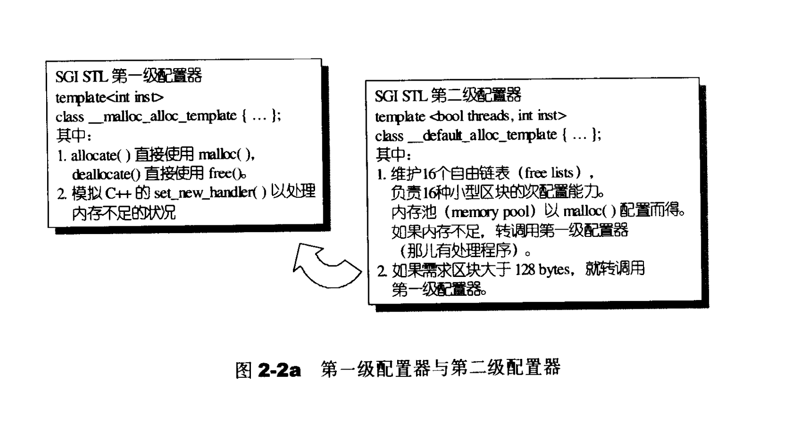
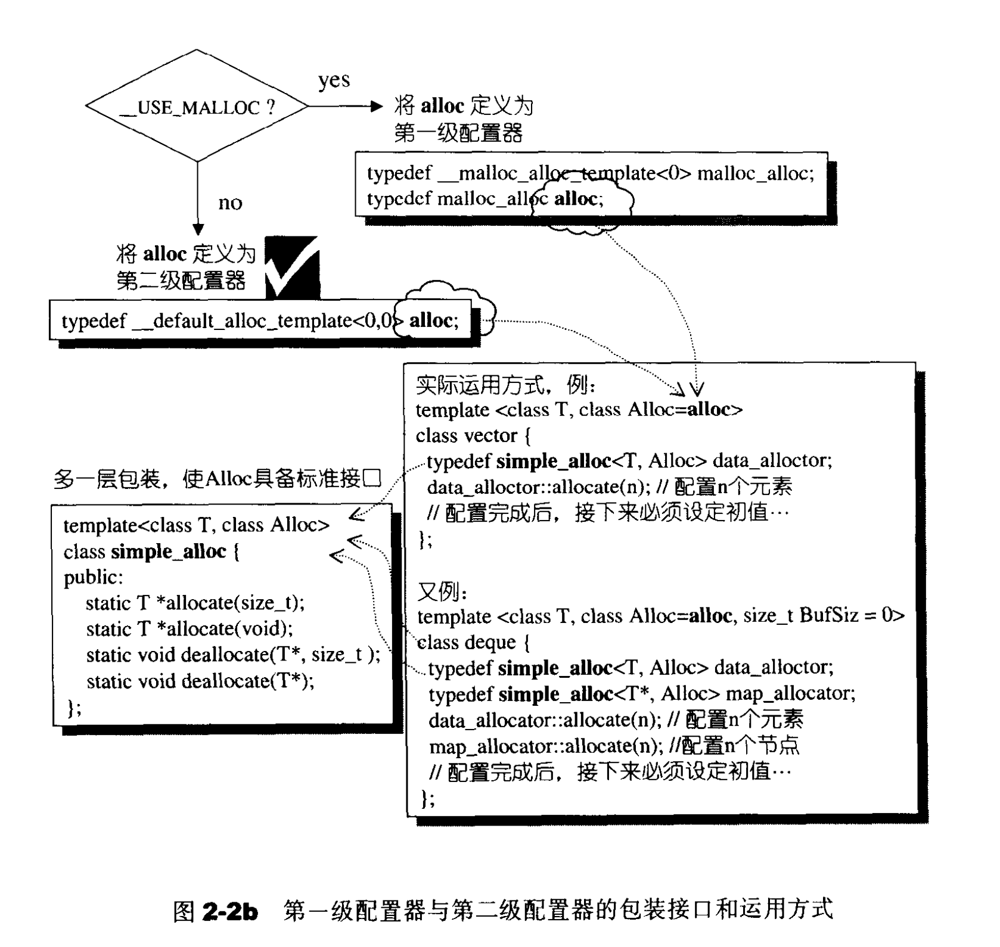

# 空间配置器

SGI标准的空间配置器，std::allocator，SGI从未使用，效率不佳，只是基层内存配置、释放行为的一层薄薄的包装，并没有考虑到任何效率上的强化。


SGI特殊的空间配置器，std::alloc

为了精密分工，STL allocator 决定将这两阶段操作区分开来。内存配置操作由 alloc:allocate(）负责，内存释放操作由 alloc::deallocate(）负责；对象构造操作由 ::construct(）负责，对象析构操作由 ::destroy（）负责。


考虑到小型区块所可能造成的内存破碎问题，SGI设计了双层级配置器，第一级配置器直接使用 mal1oc(）和 free()，第二级配置器则视情况采用不同的策略：当配置区块超过128 bytes 时，视之为“足够大”，便调用第一级配置器；当配置区块小于 128 bytes 时，视之为 “过小”，为了降低额外负担 (overhead，见 2.2.6节），便采用复杂的 memory pool 整理方式，而不再求助于第一级配置器。整个设计究竟只开放第一级配置器，或是同时开放第二级配置器，取决于 _USELMALLLOCG是否被定义（唔，我们可以轻易测试出来，SGI STL 并未定义_USE_ MALLOC)






## 自定义Vector的实现

> #### allocator需要将空间的申请与对象的构建分开的原因。
>
> 为什么需要将空间的申请与对象的构建分开？
>
> Point* pt = new Point(1,2);
>
> vector而言：reserve
>
> STL中存放的是大量元素，如果每次创建一个对象就申请一次空间，这样的话效率是非常低的，所以就可以直接一次申请一大片空间，然后在申请的空间上面进行构建对象
>
> #### 为何不全部使用malloc申请空间
>
> 1. 对于小块空间而言，频繁的申请和释放，会有内存碎片的问题
> 2. 频繁的malloc会调用系统调用，会在用户态和内核态之间频繁的切换，效率相对而言较低

```cc
copy(_start, _finish, ptmp);

 _OutputIter __copy(_InputIter __first, _InputIter __last,
                          _OutputIter __result,
                          input_iterator_tag, _Distance*)
{
  for ( ; __first != __last; ++__result, ++__first)//_M_read() cin >> _M_value
    *__result = *__first;
  return __result;
}
```

> shift+%可以进行括号匹配

### 空间配置器的实现原理

```cc
class allocator
{
  public:
     _Tp* allocate(size_type __n, const void* = 0) 
     {
         return __n != 0 ? static_cast<_Tp*>(_Alloc::allocate(__n * sizeof(_Tp))) 
                    : 0;
     }
    
    
     void construct(pointer __p, const _Tp& __val) 
     { 
         //定位new表达式
         new(__p) _Tp(__val);//new int(1);
     }
     void destroy(pointer __p) 
     { 
         __p->~_Tp(); //显示调用析构函数
     }
};
```


```cc
#include <iostream>
#include <memory>

using std::cout;
using std::endl;

template <typename T>
class Vector {
public:
    typedef T* iterator;

    Vector()
        : _start(nullptr), _finish(nullptr), _end_of_storage(nullptr) {
    }

    ~Vector();

    void push_back(const T& value);
    void pop_back();
    int size() const;
    int capacity() const;

    iterator begin() {
        return _start;
    }

    iterator end() {
        return _finish;
    }

private:
    void reallocate();  //重新分配内存,动态扩容要用的

private:
    //进行空间申请与释放，以及对象构建与销毁的类
    static std::allocator<T> _alloc;

    T* _start;           //指向数组中的第一个元素
    T* _finish;          //指向最后一个实际元素之后的那个元素
    T* _end_of_storage;  //指向数组本身之后的位置
};

template <typename T>
std::allocator<T> Vector<T>::_alloc;

template <typename T>
Vector<T>::~Vector() {
    if (_start) {
        while (_finish != _start) {
            _alloc.destroy(--_finish);  //销毁对象
        }
        _alloc.deallocate(_start, capacity());  //空间回收
    }
}

template <typename T>
void Vector<T>::push_back(const T& value) {
    // vector是不是满的
    if (size() == capacity()) {
        reallocate();  //进行扩容
    }
    if (size() < capacity()) {
        _alloc.construct(_finish++, value);  //插入对象
    }
}

template <typename T>
void Vector<T>::pop_back() {
    if (size() > 0) {
        _alloc.destroy(--_finish);
    }
}

template <typename T>
int Vector<T>::size() const  //记录元素的个数
{
    return _finish - _start;
}

template <typename T>
int Vector<T>::capacity() const {
    return _end_of_storage - _start;
}

template <typename T>
void Vector<T>::reallocate()  //重新分配内存,动态扩容要用的
{
    int oldCapacity = capacity();
    int newCapacity = 2 * oldCapacity > 0 ? 2 * oldCapacity : 1;  //新空间扩容的大小

    T* ptmp = _alloc.allocate(newCapacity);  //申请新的空间
    if (_start) {
        /* copy(_start, _finish, ptmp); */
        std::uninitialized_copy(_start, _finish, ptmp);  //在未初始化的空间上拷贝对象
        while (_finish != _start) {
            _alloc.destroy(--_finish);  //老的空间上的对象一个个进行销毁(考虑边界问题)
            /* _alloc.destroy(_start++);//老的空间上的对象一个个进行销毁(考虑边界问题) */
        }
        _alloc.deallocate(_start, oldCapacity);  //老的空间进行了回收
    }

    //三个指针之前是指向老的空间，然后扩容之后需要将三个指针与
    //新的空间产生联系
    _start = ptmp;
    _finish = _start + oldCapacity;
    _end_of_storage = _start + newCapacity;
}

template <typename Container>
void printCapacity(const Container& con) {
    cout << "con.size() = " << con.size() << endl;
    cout << "con.capacity() = " << con.capacity() << endl;
}

void test() {
    Vector<int> number;
    printCapacity(number);

    cout << endl;
    number.push_back(1);
    printCapacity(number);

    cout << endl;
    number.push_back(2);
    printCapacity(number);

    cout << endl;
    number.push_back(3);
    printCapacity(number);

    cout << endl;
    number.push_back(4);
    printCapacity(number);

    cout << endl;
    number.push_back(5);
    printCapacity(number);

    cout << endl;
    for (auto& elem : number) {
        cout << elem << "  ";
    }
    cout << endl;
}

int main(int argc, char** argv) {
    test();
    return 0;
}

```


将申请好的空间挂接在对应的自由链表下面 ，


