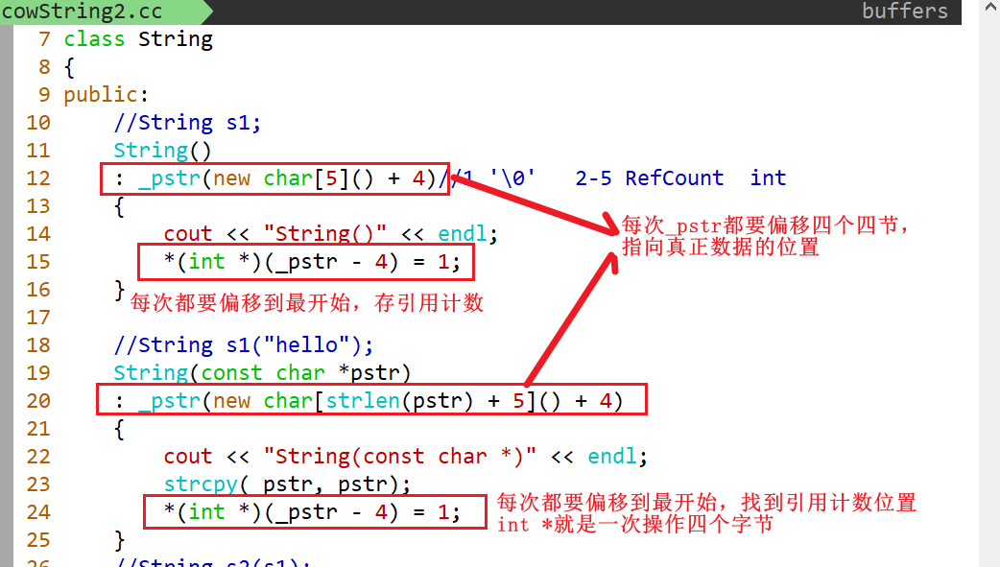
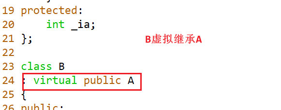

### 一、友元

面向对象的四大基本特征：抽象、封装、继承、多态。

```C++
class Point
{
   friend void display(const Point &pt);
  public:
    void print()
    {
        
    }
  protected://继承的时候会使用到
  private:
    int _ix;
    int _iy;
};

Point  pt;

void display(const Point &pt)
{
    pt._ix = 100;
}

class Line
{
    
};
```

#### 1. 形式

```C++
class A
{
  friend 函数原型;
  friend class  B;
};
```

函数的分类：成员函数和非成员函数（自由函数、普通函数、全局函数）

```C++
namespace hh
{
    void display();//带命名空间的函数声明
}

namespace wd
{
    void print()
    {
        hh:display();
    }
}


namespace hh
{
    void display()
    {
        
    }
    
    void show()
    {
        wd::print();
    }
}
```

#### 2、友元的三种使用形式

##### 2.1、友元之普通函数的形式


##### 2.2、友元之成员函数


**显示调用构造函数会创建对象,创建对象的时候会调用构造函数 ok**

##### 2.3、友元之友元类

（一个类A的所有成员函数都是另外一个类B的友元，可以将A设置为B的友元）


#### 3、友元的特点

友元是单向的，友元不具有传递性（A->B->C）,友元关系不能被继承

友元的声明是不受public/protected/private关键字限制的

### 二、运算符重载

#### 1、形式

```C++
函数返回类型   operator运算符 (参数列表)
{
}

int add(int x, int y)//error
{
    
}

Complex operator+(const Complex &lhs, const Complex &rhs)//ok
{
 
}
```

#### 2、运算符重载的规则

2.1、进行运算符重载的时候，至少有一个是类类型或者枚举类型。


2.2、运算符重载不能改变运算符的优先级与结合性

2.3、运算符重载不能改变操作数的位置、顺序（是在左边还是右边不能改变）、个数。

2.4、重载逻辑运算符（&&,||）后，不再具备短路求值特性。  

2.5、不能臆造不存在的运算符。

> #### 不能重载的运算符
>
> 1. 成员访问运算符  .
>
> 2. 成员指针运算符  .*
>
> 3. 三目运算符  ?:
>
> 4. 作用域限定符   ::
>
> 5. sizeof
>
> 
>

#### 3. 运算符重载的三种形式

##### 1、以普通函数的形式


##### 2、以成员函数的形式


##### 3、友元函数的形式


#### 4. 特殊运算符的重载

### 

#### 1、复合赋值运算符（以成员函数）


#### 2、前置++与后置++


#### 3、输出（入）流运算符的重载（不能以成员函数）

**输出流运算符不能以成员函数的形式进行重载**，因为对于输出流运算符而言，第一个参数是流对象，而将输出流运算符作为成员函数进行重载，流对象就成为了第二个参数（第一个是this），此时与运算符重载的规则，“不能改变操作数的位置”，所以输出流运算符不能以成员函数进行重载。


**对于流对象而言，是不能进行拷贝操作的**，或者说拷贝构造函数已经被删除了。（下面是不行的）


#### 4、重载函数调用运算符（必须是成员函数）

```C++
int add(int x, int y)
    
    
int operator()(int x, int y)
{
    
}
```


#### 5、下标访问运算符的重载


#### 6. 箭头与解引用运算符的重载


#### 7. 类型转换

##### 其他类型向自定义类型转换


##### 从自定义类型向其他类型进行转换。


#### 8. 类域

如果变量的名字不相同，此时变量的可见域与变量的作用域是等同的；但是如果变量名字相同的时候，变量的可见域是小于变量的作用域的。


### 三、内部类

#### 1. 定义

将一个类A的定义写到另外一个类B中，此时类A就是类B的内部类。

#### 2. 例子

内部类的使用案例，pimpl


```cc
//line.hh
#ifndef __LINE_H__
#define __LINE_H__

class Line {
public:
    Line(int, int, int, int);
    void printLine() const ;
    ~Line();

    class LinePimpl; // 前向声明
private:
    LinePimpl* _pimpl; // 指针，不用知道LinePimpl的实现
};

#endif
```

```cc
//line.cc
#include "line.hh"
#include <iostream>

using std::cout;
using std::endl;

class Line::LinePimpl {
public:
    LinePimpl(int ix1, int iy1, int ix2, int iy2)
    : _pt1(ix1, iy1)
    , _pt2(ix2, iy2)
    {}

    void printLinePimpl() const {
        _pt1.print();
        cout << "--->";
        _pt2.print();
        cout << endl;
    }

    ~LinePimpl(){
        cout << "~LinePimpl()" << endl;
    }

    class Point {
    public:
        Point(int ix=0, int iy=0)
        : _ix(ix)
        , _iy(iy)
        {}

        void print() const {
            cout << "(" << _ix << ", " << _iy << ")";
        }

        ~Point(){}
    private:
        int _ix, _iy;
    };

private:
    Point _pt1, _pt2;
};


Line::Line(int ix1, int iy1, int ix2, int iy2)
: _pimpl(new LinePimpl(ix1, iy1, ix2, iy2))
{
    cout << "Line(int, int, int, int)" << endl;
}
void Line::printLine() const {
    _pimpl->printLinePimpl();
}

Line::~Line(){
    cout << "~Line()" << endl;
    if(_pimpl){
        delete _pimpl;
        _pimpl = nullptr;
    }
}
```

```cc
//testLine.cc
#include "line.hh"
#include <iostream>

using std::cout;
using std::endl;

int main()
{
    Line line(1,2,3,4);
    line.printLine();
    return 0;
}
```

### 五、单例模式的自动释放

#### 5.1、内存泄漏的检测工具valgrind

##### 安装

```Linux
sudo apt install valgrind
```

##### 使用


#### 5.2、单例模式自动释放的四种方法

##### 1、友元类


##### 2、内部类 + 静态数据成员


##### 3、饿汉模式 + atexit


##### 4、pthread_once + atexit


### 六、string的底层实现

```C++
class String
{
public:
    String(const String &rhs)
     : _pstr(new char[strlen(rhs._pstr) + 1]())
     {
         strcpy(_pstr, rhs._pstr);
     }
 private:
  char *_pstr;  
};
String s1("hello");
String s2(s1);//深拷贝
String s3(s2);

//s1 s2 s3只是需要执行读操作，而不是写操作
//在执行读操作的时候，进行浅拷贝，在执行写操作的时候，进行深拷贝
```

**cow 写时复制**：在执行写操作的时候，进行复制操作。使用**浅拷贝 + 引用计数**。

在ubuntu14.04上使用了写时复制


```C++
&pInt        0x7ffe0b50b948
s1'address = 0x7ffe0b50b960
s2'address = 0x7ffe0b50b980
s3'address = 0x55ff8da49e90
 pInt        0x55ff8da49e70
&pInt 0x7ffe0b50b948
pInt 0x55ff8da49e70

```

**sso**：短字符串优化，当字符串的长度小于等于15字节的时候，会存在栈上；当字符串的长度大于等于16字节的时候，存储在堆上。ubuntu18.04

#### 写时复制的关键在于引用计数的存放


写代码时候的图解




赋值运算符与析构函数


### 二、继承

#### 1. 基本概念

面向对象的四大基本特征：抽象、封装、**继承**、多态。

C++对于继承的含义：从既有类（基类，父类）产生新类（派生类）的过程。

#### 2. 形式

```cc
class 派生类
: public/protected/private 基类的类名 //类派生列表
{};
```

#### 3. 派生类在创建过程中的三个步骤

1. **吸收**基类的成员
2. **改变**基类的成员
3. **新增**成员

成员：包括数据成员与成员函数（数据成员可以被派生类吸收，有部分成员函数是不能被继承的）

#### 4. 继承的局限性

1. 友元关系不能被继承
2. 构造函数不能被继承，析构函数不能被继承
3. operator new，operator delete，operator=也不能被继承

#### 5. 不同派生方式对基类成员的访问

1. 不管以什么继承方式，派生类类体中都不能直接访问基类的私有成员（封装性的体现）
2. 不管以什么继承方式，派生类类体中除了基类的私有成员外，其他的都可以访问
3. 对于派生类对象而言，只能访问公有继承的基类中的公有成员，其他的都不能访问

派生类需要完成从基类吸收过来的数据成员的初始化（不能直接访问基类中的私有数据成员）

基类中的私有成员不能在类外进行直接访问，体现的是封装的特点，当然友元除外。

#### 6. 保护继承与私有继承的区别

保护继承基类中的非私有成员，在以后可以无限继承下去；

但私有继承基类中的非私有成员，不能再继续继承下去。

默认的继承方式是私有的。

#### 7. 派生类对象的构造与销毁

##### 派生类构造函数的格式

```cc
派生类对象构造函数(参数列表)
: 基类构造函数名字(参数列表)
{};
```

> 错误的说法：在创建派生对象的时候，先调用基类的构造函数，再调用派生类的构造函数。
>
> 正确的说法：在创建派生类对象的时候，会调用派生类自己的构造函数，但是为了完成从基类这里吸收的数据成员的初始化，所以借用基类的构造函数完成初始化工作，然后再调用派生类自己的构造函数的函数题。

**总结**：不管基类与派生类有没有显式定义构造函数，当创建派生类对象的时候，会调用派生类自己的构造函数；为了完成从基类这里吸收过来的数据成员的初始化，必须要调用基类的构造函数（默认情况下，会调用基类的无参构造函数，而如果基类没有显示定义默认的构造函数，或者基类的默认构造函数没有提供的话，此时会报错）；如果每次在派生类的构造函数的初始化列表中，显示的写出基类的构造函数，此时肯定就没有问题。

**必须将基类构造函数放在派生类构造函数的初始化列表中，以调用基类构造函数完成基类数据成员的初始化。**(如果不调用，会默认调用基类的初始化函数)

##### 派生类构造函数的调用顺序

1. 先分配空间
2. 调用基类构造函数完成基类数据成员的初始化
3. 如果有特殊数据成员，const成员、引用成员、类对象数据成员，放在派生类构造函数的初始化列表中
4. 执行派生类构造函数的函数体

##### 派生类析构函数的调用顺序

1. 先调用派生类的析构函数
2. 再调用派生类中成员对象的析构函数
3. 最后调用普通基类的析构函数

当派生类对象进行销毁的时候，派生类的析构函数会被自动调用（完成派生类自己新增数据成员清理操作），然后**基类的析构函数会被自动调用**（作用是，为了完成从基类这里吸收过来的数据成员的清理操作）。

#### 8. 多基继承（多基派生）

##### 形式

```cc
class 派生类
: public/protected/private 基类1
: public/protected/private 基类N
{};
```

基类的构造函数的调用顺序，与其在派生类的初始化列表中的顺序没有关系；基类构造函数的执行顺序与基类被**派生类继承的先后顺序**有关。

对于每一个基类，都应该在其前面加上继承方式，否则就会默认为是私有继承。

##### 多基派生产生的两个问题

1. 成员函数访问冲突。解决方案：类名+作用域限定符。
2. 数据成员的存储二义性。解决方法：使用虚拟继承

#### 4. 基类与派生类对象间的转换

**类型适应**：类A可以适应类B的所有场景。**派生类可以适用于基类**

可以从派生类向基类进行转换，但是不能从基类派生类进行转换

```cc
Base& ref = derived;
Base* pbase = &derived;
```

向上转型：派生类向基类进行转换，语法支持，安全。

向下转型：基类向派生类进行转换，原本语法不支持，但是可以强制转换。

```
Derived* pderived2 = static_cast<Derived*>(&base2); //向下转型，不安全

Base* pbase3 = &derived3;
Derived* pderived3 = static case<Derived*>(pbasee3); //向下转型，安全
```

### 一、派生类对象之间的复制控制

1. 如果用户定义了基类的拷贝构造函数，而没有定义派生类的拷贝构造函数，那么在用一个派生类对象初始化新的派生类对象，两对象间的派生类部分执行缺省的行为，而两对象间的基类部分执行用户定义的基类拷贝构造函数。

2. 如果用户重载了基类的赋值运算符函数，而没有重载派生类的赋值运算符函数，那么在用一个派生类对象给另一个已经存在的派生类对象赋值时，两对象间的派生类部分执行缺省的赋值行为，而两对象间的基类部分执行用户定义的重载赋值函数。

3. 如果用户定义了派生类的拷贝构造函数或者重载了派生类的对象赋值运算符=，则在用已有派生类对象初始化新的派生类对象时，或者在派生类对象间赋值时，将会执行用户定义的派生类的拷贝构造函数或者重载赋值函数，而不会再自动调用基类的拷贝构造函数和基类的重载对象赋值运算符，这时，通常需要用户在派生类的拷贝构造函数或者派生类的赋值函数中显式调用基类的拷贝构造或赋值运算符函数。

```cc
Derived(const Derived& rhs)
: Base(rhs) //显示调用基类的拷贝构造函数
, _pderived(new char[strlen(rhs._pderived)+1]()){
    cout << "Derived(const Derived&)" << endl;
    strcpy(_pderived, rhs._pderived);
}

Derived& operator=(const Derived& rhs){
    cout << "Derived& operator=(const Derived&)" << endl;
    if(this != &rhs){
        Base::operator=(rhs);
        
        delete [] _pderived;
        _pderived = nullptr;
        
        _pderived = new char[strlen(rhs._pderived)+1]();
        strcpy(_pderived, rhs._pderived);
    }
    return* this;
}
```

### 二、写时复制区分读写（代理模式）

```cc
class CharProxy{
public:
	CharProxy(String& self, size_t idx)
	: _self(self)
	, _idx(idx) {}
	
	char& operator=(const char& ch);
	
	operator char(){
		cout << "operator char()" << endl;
		return _self._pstr[_idx];
	}
	
	/*friend std::ostream& operator<<(std::ostream& os, const CharProxy& rhs); //也可*/
private:
	String& _self; //此时String是不完整类型
	size_t _idx;
};

char& String::CharProxy::operator=(const char& ch){
    if(_idx<_self.size()){
        if(_self.getRefCount()>1){ //考虑共享
            char* ptmp = new char[_self.size()+5]()+4;
            strcpy(ptmp, _self._pstr);
            _self.decreaseRefCount();
            _self._pstr=ptmp;
            _self.initRefCount();
        } 
        _self._pstr[_idx] = ch;
        return _self._pstr[_idx];
    } else {
        static char charnull = '/0'; //静态对象生命周期
        return charnull;
    }
}
```

### 三、阅读第三方库的方式

1. 找到相应的头文件目录与实现文件目录（找源码，可以完全掌控第三方库的原理）

2. 可以看看是不是有测试文件（加快该第三方库的使用）

3. 需要找main函数，main函数是入口函数（找到突破口）

4. 别人是怎么样使用该第三方库的。参考其中的例子

### 四、多态

#### 1. 基本概念

多态：对于同一种指令，针对不同的对象，产生不一样的行为。

作用：

1. 隐藏实现细节，使得代码能够模块化；扩展代码模块，实现代码重用；

2. 接口重用：为了类在继承和派生的时候，保证使用家族中任一类的实例的某一属性
   时的正确调用。

#### 2. 多态的类型

静态多态：包括函数重载、运算符重载、模板。**发生的时机在编译的时候**。

```cc
int add(int, int);
double add(double, double);
string add(string, string);


string operator+(string, string);
Point operator+(Point, Point);
Complex operator+(Complex, Complex);

add(1, 2);
add(1.1, 2.2);
```

动态多态：发生的时机在运行时。虚函数。


#### 3. 虚函数的概念

在**成员函数**的前面加上**virtual**的函数称为虚函数。

```C++
class A
{
  public:
    virtual void print(int x, double y)
    {
        //......
    }
};

class B
: public A
{
   //print
    virtual void print(int x, double y)
    {
        //.....
    }
};
```

当派生类继承基类的时候，基类的虚函数会被派生类继承，该虚函数在派生类里面仍然是虚函数，即使在派生类中不加virtual关键字，该函数仍然是虚函数。

> 虚函数必须在类里面定义。？

派生类**重定义**虚函数的时候，格式非常严格

1. 函数名字要相同

2. 函数的参数列表要完全相同（参数的个数、参数的类型、参数顺序）

3. 函数的返回类型也必须相同

总结：除了函数的函数体可以不一样之外，其他的都必须一样

#### 4. 虚函数的原理（动态多态的原理）


当基类定义了虚函数的时候，就会在基类的对象的存储布局前面多一个虚函数指针，该虚函数指针指向基类自己的虚函数表（也称为虚表），该虚表存放的是虚函数的入口地址；当派生类继承基类的时候，会吸收基类中的虚函数，此时派生类自己也会有自己的虚函数，有虚函数就会在派生类对象的存储布局前面产生一个虚函数指针，该虚函数指针会指向派生类自己的虚函数表，派生类自己的虚表存放是是自己的虚函数的入口地址，如果此时派生类重定义了该虚函数，就会用派生类自己的虚函数的地址去覆盖从基类吸收过来的虚函数的入口地址。

> ```cc
> #include <stdio.h>
> 
> class P1
> {
> public:
>     virtual ~P1() {}
> };
> 
> class P2
> {
> public:
>     virtual ~P2() {}
> };
> 
> class Derived: public P1, public P2
> {
> };
> 
> int main()
> {
>   Derived *b = new Derived();
>   printf("allocated at address %p\n", b);
> 
>   P2 *s = b;
>   printf("delete at address %p\n", s);
>   delete s;
> 
>   //地址不一样，是因为指向的虚表地址不同
>   return 0;
> }
> 
> /*
> ❯ ./a.out
> allocated at address 0x557cdad29e70
> delete at address 0x557cdad29e78
> */
> ```
>
> 

#### 5. 虚函数被激活的五个条件

1. 基类要定义虚函数
2. 派生类要重定义（重写、覆盖）该虚函数
3. 创建派生类对象
4. 用基类的指针（引用）指向（绑定）派生类的对象
5. 用基类的指针（引用）调用虚函数

#### 6. 哪些函数不能设置为虚函数

1. 普通函数（自由函数、全局函数）（非成员函数）：虚函数必须是一个成员函数。

2. 静态成员函数：从发生时机上看，静态函数调用时机在编译的时候，而虚函数要体现动态多态，发生时机在运行时候；静态成员函数没有this；

3. 内联成员函数：发生时机在编译时候，而虚函数要体现动态多态，在运行的时候；如果将内联函数设置为虚函数，此时该内联函数已经失去内联的含义。

4. 友元函数。如果友元函数本身是一个普通函数，就不能被设置为虚函数；但是如果友元函数本身是一个成员函数，它是可以被设置为虚函数的。

```cc
/*友元的例子*/
class Base;

class Line {
public:
	virtual void show(Base& base);
};

class Base {
	friend void Line::show(Basee& base);
public:
	Base(long base = 0)
	: _base(base){}
};
```

5. 构造函数：发生的时机在编译的时候，而虚函数要体现动态多态，发生的时机在运行时候；如果将构造函数设置为函数，需要在虚表中存放虚函数的入口地址，需要通过虚函数指针找到虚表，而虚函数指针位于对象的内存布局的前面，而构造函数不调用，对象本身是不完整的（初始化还没有成功，在内存中的布局还不完整），就不知道虚函数指针是否存在，就不能找到虚表，就不能调用虚函数；从继承角度看，构造函数不能被继承，而虚函数是可以被继承的。

#### 7. 虚函数的访问

1. 使用指针调用虚函数，可以体现出多态

2. 使用引用调用虚函数，可以体现出多态

3. 对象调用虚函数，没有体现多态

4. 可以使用其他成员函数调用虚函数，可以体现动态多态。

```cc
Base* pbase1 = &derived;
Base* this = pbase1;
void func1(){
    this->print(); //可以体现多态
}
```

5. 使用构造函数与析构函数调用虚函数，没有体现多态。

> **对象的销毁与析构函数的执行是不是等价的？**
>
> 栈对象的，等价；堆对象，析构函数的执行只是对象销毁一部分。
>
> **虚函数与动态多态是不是等价？**
>
> 动态多态的体现必须要有虚函数；但是有虚函数并不一定体现动态多态。
>
> **虚函数的函数体才有可能在运行时确定，其他的全部在编译时候就确定，包括函数的参数。**
>
> ```cc
> class A
> { 
> public:
>     virtual
>     void func(int val = 1)
>     {
>         cout << "A->" << val << endl;
>         int b = 10;
>     } 
>     
>     virtual 
>     void test()
>     {
>         func();
>     }
> private:
>     long _a;
> };
> 
> class B
> : public A
> { 
> public:
>     virtual
>     void func(int val = 10)
>     {
>         val += 1;
>         cout << "B->" << val << endl;
>     }
> private:
>     long _b;
> };
> 
> int main(void)
> {
>     B b;
>     A *p1 = (A*)&b;
>     B *p2 = &b;
>     
>     p1->func();
>     p2->func();
>     
>     return 0;
> }
> ```

### 五、抽象类

抽象类是作为接口使用的。

声明了纯虚函数的类，称为抽象类

抽象类是不能创建对象

> ##### 什么是纯虚函数？什么是抽象类？抽象类的作用是什么？
>
> 答：抽象类是含有纯虚函数的类，其作用是作为多个表象不同，但本质相同类的抽象。
> 故抽象类仅可以作为基类被继承，不可以实例化生成对象，不能初始化，不能被当做返回值，不能当做参数，但可以做指针类型和引用

```cc
class Base {
public:
    //纯虚函数，声明了虚函数，但是没有实现
	virtual void print() const = 0;
    virtual void display() const = 0;
};

//抽象类的派生，如果也有纯虚函数没有实现，那么抽象类的派生类也是抽象类，抽象类不能创建对象
class Derived
: public Base {
    virtual void print() const override {
        cout << "Derived::print()" << endl;
    }
}

Base* pbase;
Derived* pderived;
return 0;
```

##### 抽象类作为接口使用的例子

```cc
//可以实现多态
//面向对象的设计原则: 开闭原则，对扩展开放，对修改关闭
class Figure
{
public:
    virtual
    void display() = 0;
    virtual 
    double area() = 0;
};
```

##### 抽象类的第二种形式

将构造函数设置为protected

```cc
class Base {
protected:
    Base(){ cout << "Base()" << endl; }
}

Category &root = Category::getRoot();
```

### 六、虚析构函数

为了解决内存泄漏。

如果基类的析构函数没有设置为虚函数，则在执行delete 基类指针时，不会调用派生类的析构函数，会造成内存泄漏。此时，将基类的析构函数设为虚函数，就可以解决问题。

当基类的析构函数设置为虚函数，派生类的析构函数自动改变为虚函数，认为该派生类函数属于重写。这样，系统将先执行派生类对象的析构函数，然后再执行基类的析构函数。

对于任何一个类而言，析构函数只有一个，是唯一的，编译器会将析构函数改名为destructor。

```cc
virtual ~Base(){
    cout << "~Base()" << endl;
    if(_pbase){
        delete [] _pbase;
        _pbase = nullptr;
    }
}
```

### 七、三个重要概念

重载：在**同一个作用域**中，**函数名字相同**，**参数列表不一样**（参数类型、参数个数、参数顺序）（单靠返回类型不能区分重载）

覆盖（重定义、重写）：在基类与派生类中，**虚函数**的名字与参数列表都要一样。

隐藏：在基类与派生类中，派生类中的函数屏蔽了基类中的**同名函数**。（同名的数据成员也可以发生隐藏）（**除非用作用域限定符或者是基类指针或基类引用**）

> ##### 什么是重载？什么是隐藏？什么是覆盖？他们之前的区别是？
>
> 答：成员函数被重载特征是：
>
> （1）相同的范围（在同一个类中）；
> （2）函数名字相同
> （3）参数不同
> （4）virtual 关键字可有可无
>
> 覆盖就是指派生类函数覆盖基类virtual函数，特征是：
> （1）不同的范围（分别位于派生类与基类）
> （2）函数名字相同
> （3）参数相同
> （4）基类函数必须有virtual 关键字
>
> “隐藏”是指派生类的函数屏蔽了与其同名的基类函数，派生对象都是调用派生类的同名函数。规则如下：
> （1）如果派生类的函数与基类的函数同名，但是参数不同，此时不论有无virtual关键字、基类的函数将被隐藏;
> （2）如果派生类的函数与基类的函数同名，并且参数也相同、但是基类函数没有virtual 关键字，此时基类的函数被隐藏（注意别与覆盖混淆）；
> 总结：
> ①同一类中的同名函数是重载；
> ②不同类中同名函数可能是覆盖，也可能是隐藏。根据是否有virtual以及函数参数是否相同区分；

### 八、虚表的存在

虚表是存在的，就普通单继承而言，虚表只有一个，虚表存在**只读段**

### 九、多基派生的二义性

如何验证一个函数是不是虚函数？

tip：后面加个override

可以再继续的写一个派生类，让其继承，并将其在该函数重新在派生类中实现一次。

### 十、继承多态的内存布局

#### 1. 普通继承与虚拟继承的区别？

虚拟继承会多一个**虚基指针**，虚基指针指向虚基表，虚基表中存放的是虚基指针距离派生类对象首地址的偏移信息，以及虚基指针距离虚基类的偏移信息；此时派生类对象的数据成员存放在基类数据成员的前面。


#### 2. 普通继承的时候，派生类有新增虚函数？


#### 3. 虚拟继承，基类带虚函数，派生有新增虚函数


总结：有虚函数就会有虚函数指针，有虚拟继承就会有虚基指针，虚函数指针指向虚函数表，虚基指针指向虚基表。

如果是**普通继承**的话，**基类的布局形式**会存在派生类对象的**前面**，派生类的布局形式就会排在后面。如果派生类自己新增虚函数，对派生对象的大小是没有影响的，新增虚函数只会存在之前的虚表中。

如果是**虚拟继承**的话，**派生类的布局**形式会在派生类对象的**前面**，基类的布局形式在后面。如果派生类有**新增虚函**数，**派生类对象的大小会发生变化**，会多产生一个虚函数指针，用来存放新的虚函数的入口地址。

#### 4. 普通多继承


#### 5. 棱形继承

存在的存储二义性的问题


虚拟继承解决棱形继承产生的存储二义性问题


> 1.问题：多重继承 ==》 派生类对象中内存重复 ==》 访问冲突 内存浪费
> 2.解决：对出现多份的数据在最近的继承前加viture
> 3.虚继承时，虚基类指针vbptr指向虚基类表vbtable，虚基类表中存放的就是数据相对于虚基类指针的偏移，从而根据偏移找到数据
> vbptr ==> vbtable
> vbtable 中：
> 0 当前最近作用域的偏移 - vbptr的偏移
> 1 虚继类数据的起始偏移 - vbptr的偏移
>
> //虚基指针所指向的虚基表的内容：
> //	1. 虚基指针的第一条内容表示的是该虚基指针距离所在的子对象的首地址的偏移
> //	2. 虚基指针的第二条内容表示的是该虚基指针距离**虚基类子对象**（指的是virtual Base B）的首地址的偏移

### 十一、虚拟继承

虚拟继承与虚函数中的virtual的关系，二者都表示存在、间接、共享。

#### 虚函数中的虚

1、虚函数是存在的
2、虚函数必须要通过一种间接的运行时（而不是编译时）机制才能够激活（调用）的函数（虚表）
3、共享性表现在基类会共享被派生类重定义后的虚函数

#### 虚拟继承中的虚

1、存在即表示虚继承体系和虚基类确实存在
2、间接性表现在当访问虚基类的成员时同样也必须通过某种间接机制来完成（通过虚基表来完成）
3、共享性表现在虚基类会在虚继承体系中被共享，而不会出现多份拷贝（最终的派生类负责虚基类的数据成员的初始化）





> C++语言规定，虚基类子对象是由最远派生类的构造函数通过调用虚基类的构造函数进行初始化的。最远派生类是指在多层次的继承结构中，创建对象所指定的类。如果一个派生类有一个直接或间接的虚基类，则派生类的构造函数的成员初始化列表中必须包含对虚基类构造函数的调用。如果未列出，则表示该虚基类的默认构造函数来初始化派生类派生类对象中的虚基类子对象。为了保证虚基类子对象只被初始化一次，规定在创建对象的最远派生类的构造函数中调用虚基类的构造函数，而该派生类的基类构造函数中忽略对虚基类构造函数的调用。
>
> C++语言有规定，在派生类构造函数的成员初始化列表中，出现虚基类构造函数先于非基类构造函数的调用。
>
> 4、多继承派生类构造函数构造对象时，(B)被最先调用。
> A．派生类自己的构造函数       B．虚基类的构造函数
> C．非虚基类的构造函数      　 D．派生类中子对象类的构造函数
>
> 顺序都是先调用派生类，但是题干中说的是派生类函数构造对象，因此是虚基类先。

#### 虚基继承的形式

```C++
class Derived
: virtual public/protected/private Base
{
  //  
};
```

虚继承的派生类对象的析构

效率分析

能用单继承的就不要用多继承，能用普通继承就不要用虚继承

### 十二、移动语义

#### 1、左值与右值的概念

左值：可以取地址。

右值：不能进行取地址。包括临时变量、临时对象（string("world")）、字面值常量。

左值引用：int &ref = a;左值引用可以绑定到左值，但是不能绑定到右值（int &ref1 = 10,error）

const左值引用：const  int &ref = a;  const int &ref = 10;const左值引用既可以绑定到左值，也可以绑定到右值。

> ##### C++11为什么要引入右值引用？  
>
> 帮助const分担工作，用于移动语义。
>
> https://blog.csdn.net/waxtear/article/details/104199314

**右值引用本身可以是左值，可以进行取地址（int &&ref = 10）,但是右值引用也可能是右值（函数的返回参数是右值引用的情况）**

```C++
int&& func()
{
    return 10;
}
&func();//error,右值引用本身也可以是右值
```


引用为左值引用。右值引用用来绑定到右值，绑定到右值以后本来会被销毁的右值的生存期会延长至与绑定到它的右值引用的生存期。

> #### 代码区
>
> 代码区通常存放的是C++源程序的函数体经过编译后产生的二进制代码。
>
> 可执行文件在被加载进内存后，就存放在代码区。代码区的数据是只读的，尝试修改代码区的数据将会导致运行时错误。一些重要的数据，为防止在运行时被非法修改，在编译后也会被存放进代码区，如使用const限定符修饰的常变量，在编译器优化代码时，就会将程序中的常变量的值放进代码区。
>
> #### 全局/静态变量区
>
> 全局/静态区中存放的是全局变量或静态变量，这些变量的生命周期和程序的运行期相同。全局变量或者静态变量会增加程序模块之间的耦合性，不利于降低程序的复杂度，因此在编码时要谨慎使用全局变量。
>
> 全局变量或者静态变量一定具有初始值，要么在程序中显示指定，要么是编译器默认的零值（整型变量是0，布尔变量是false,指针变量是null，字符串是空串，等）。
>
> 在使用别的变量或者函数来为全局变量赋初值时，实际上分为了两步，第一步是全局/静态变量首先被初始化为0，第二步是，利用别的变量的值或者函数返回值来为全局/静态变量赋值。
>
> #### 堆区
>
> 堆的具体实现方式和管理方式与操作系统有关，不同的操作系统实现的细节不同。
> 堆的实现和管理的一般原理是：操作系统维护一个记录空闲内存地址的链表，当系统收到程序的内存空间的申请时，会遍历该链表，寻找第一个空间大于申请空间的结点，然后将该结点从链表中删除，并将该结点分配给程序。一般在申请到的内存空间的首地址上记录此次分配的内存空间的大小，以便在内存空间使用完毕后回收该内存空间。寻找可用空间时堆结点的大小不一定等于申请的空间的大小，系统会将多余的空间自动重新放入空闲链表中。
>
> 由于对内存空间是链表维护的，所以是不连续的内存空间。堆是向高地址拓展的数据结构，链表的遍历方向也是由低地址向高地址。
>
> 堆获取内存空间的优点是方便灵活，可以获得比较大的内存空间，便于构造复杂的数据结构；缺点是获取速度较慢，容易产生内存碎片。
>
> 在C语言中，动态内存的申请和释放使用的是malloc()和free()这两个函数。C++中使用的是new和delete操作。在C++中使用new和delete会自动使用构造函数和析构函数，而调用malloc和free则不会，所以在C++中提倡使用new和delete。
>
> #### 栈区
>
> 栈是由编译器产生的代码来管理的，不需要程序员进行栈空间的分配和释放。
>
> 在Windows平台下，栈是一块从高地址向低地址方向生长的空间，栈指针寄存器esp总是指向组后一个入栈的字节。随着新元素入栈，esp的值将逐渐减小。在程序运行时，只要栈可用空间大于程序所需空间，操作系统就会为程序分配栈空间，否则程序将报错，提示栈溢出。
>
> 在默认情况下，栈的最大容量是规定好的。在windows平台下默认栈的最大容量是1M。
>
> C++程序的函数调用是通过栈实现的。函数返回地址、参变量、非静态局部、临时变量、函数的返回值都是分配在栈上。由于栈是由编译器管理的，所以栈的的存取效率较高，但是栈容量相对较小，所以在管理某些临时量的时候需要使用堆。
>
> #### 常量区
>
> 常量区是用来存放字符串常量的内存区，在程序结束后由系统释放。
>
> #### 示例
>
> ```cc
> #include<iostream>
> int a = 1;//显示初始化全局变量，全局变量a的内存空间将会被分配在全局/静态变量区
> char* p;//没有显示设置初始值，编译器自动为全局变量设置初始的零值，对于指针变量零值就是nullptr
> 
> int main()
> {
> 	int b;//非静态局部变量，空间分布在栈上，且初始值不定
> 	char s[] = "hello,world!";//非静态局部字符数组，数组元素分配在栈上
> 	char* p;//非静态局部指针变量，内存空间分配在栈上
> 	char* s1 = "c++ is best";//非静态局部指针变量s1内存空间在栈上，而字符串"c++ is best"存储在常量区
> 	static int c = 0;//局部静态变量，内存空间被分配在全局/静态变量区
> 
> 	p = new char[10];//动态申请的10字节的内存空间被分配在堆上
> 	strcpy(p,"c++ is best");//字符串"c++ is best"存放在常量区，编译器可能会将它与s1所指向的的"c++ is best"优化成一个地方
> 
> 	return 0;	
> }
> 
> ```

> ```
> using WarriorPtr = shared_ptr<Warrior>;
> typedef shared_ptr<Warrior> WarriorPtr;
> ```
>
> **两者等价。**

#### 2、移动构造函数


#### 3、移动赋值函数


#### 5、左值右值再探


```C++
&cx = 0x56148ef3e388
&c =    0x7ffd7c8b50fc
&cy =   0x7ffd7c8b50f8
&pstr = 0x7ffd7c8b5100
pstr =   0x56148ef3e37c
&cx =    0x56148ef3e388
```

总结：文字常量区的变量，并不一定是字符串，有可能是const修饰的全局变量；用const修饰的变量并不一定位于内存中的同一块区域。


#### 6、std::move的特点


