对于一个工程、项目

面向对象的分析（OOA）：需求、做什么

面向对象的设计（OOD）：怎么样做

面向对象的编程（OOP）：具体实现


软件需求是一直都在变化的，想以最小的代价去满足需求的变化。

UML：统一建模语言，一个是类图、一个是序列图

## 类于类之间的关系

### 1. 继承

可以使用空心三角箭头从派生类指向基类。

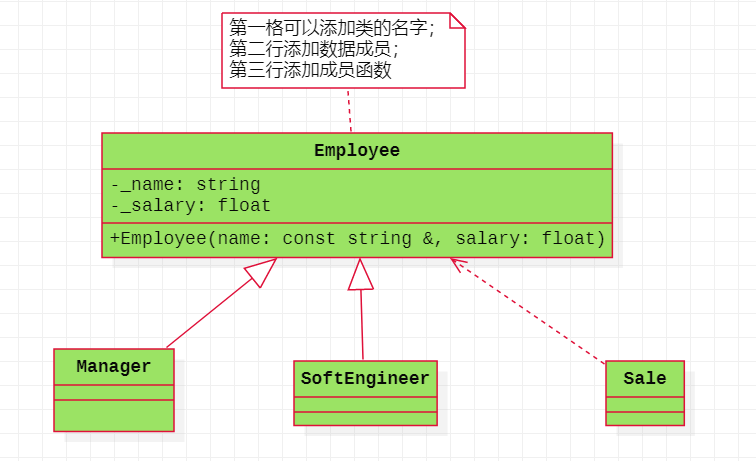

### 2. 关联

代码上：数据成员使用的是指针或引用。彼此时间不会负责对方生命周期的销毁

双向的关联关系（客户与订单之间的关系）（直接使用直线连接两个类）

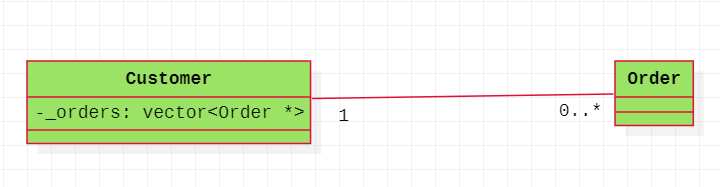

单向的关联关系（条件变量知道互斥锁的存在，互斥锁不知道条件变量的存在，可以使用从条件变量到互斥所以的箭头）

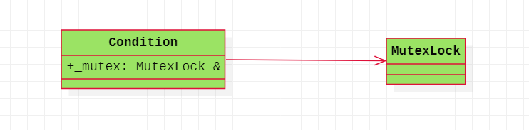

### 3. 聚合

从部分指向整体的一个空心菱形箭头，类与类之前表现问整体与部分的关系，整体部分并不负责局部部分的销毁，在代码上面可以使用指针或者引用。

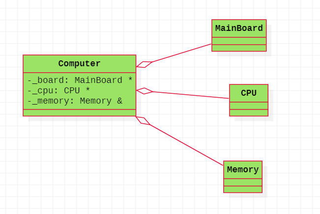

### 4. 组合

从部分指向整体的实心菱形箭头，整体部分会负责局部对象的销毁，可以将局部类创建的对象作为整体的数据成员。

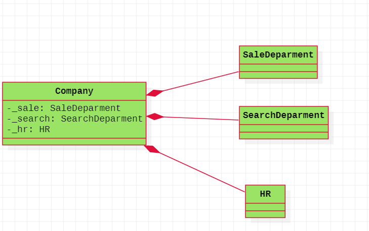

### 5. 依赖

从A指向B的虚线箭头。在代码上面表现为：B作为A的成员函数参数；B作为A的成员函数的局部变量（B作为A的成员函数返回值）；A的成员函数调用B的静态方法

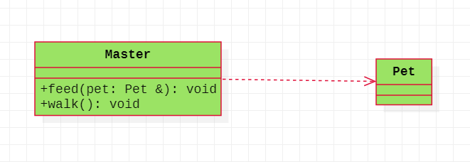

### 总结 

耦合：两个模块或者两个部分之间的连接关系。低耦合（让两个模块或者两个类之间的关系变得微弱一些）

1、继承表现的是类与类之间的纵向关系（垂直关系），其它四种表现的是类与类之间的横向关系
2、从耦合程度看的话：依赖 <  关联关系  <   聚合  <    组合     <  继承（泛化）
3、语义上：继承（A is  B）、关联、聚合、组合（A has B）、依赖（A use  B）
4、 组合+依赖（基于对象） vs  继承 + 虚函数（面向对象）

## 面向对象的设计原则

总纲：**低耦合**（模块与模块之间，类与类之间的关系），**高内聚**（模块内部或者类内部的关系）

### 单一职责原则

核心：一个类或者一个模块尽量只做一件事情，只有一个引起类或者模块变化的外因。

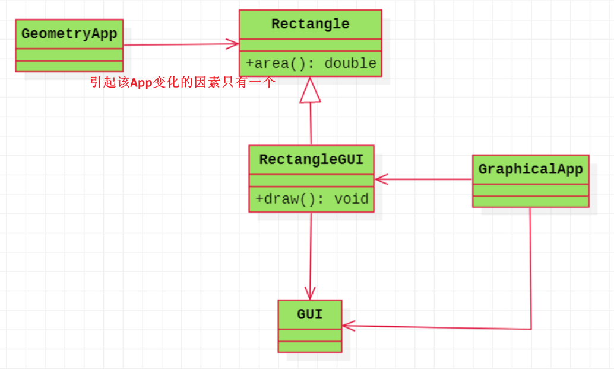


### 2. 开闭原则

核心：对扩展开放，对修改关闭

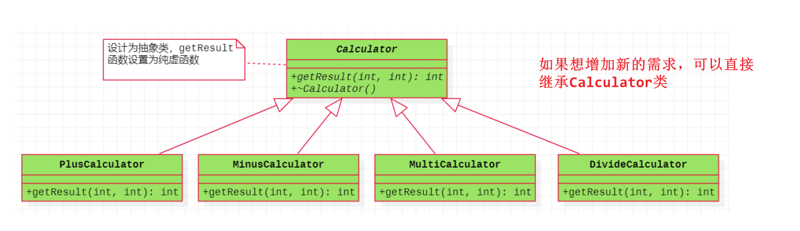

### 3. 里氏替换原则

核心：派生类必须能够替代基类。

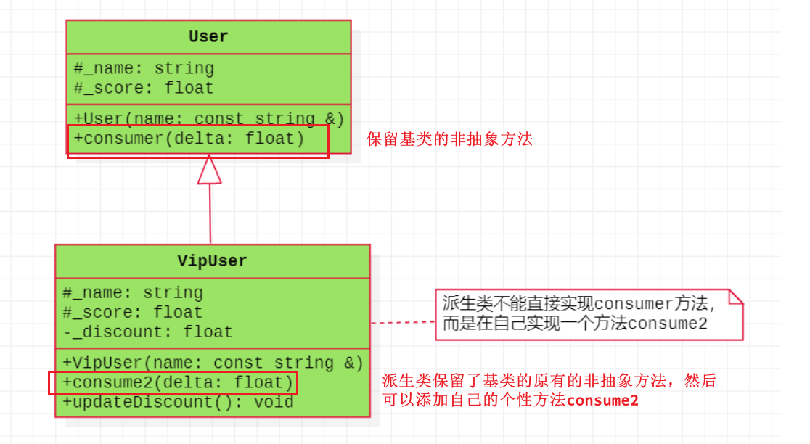

### 4. 接口分离原则

核心：使用多个小的专门的接口，而不要使用一个大的总接口


### 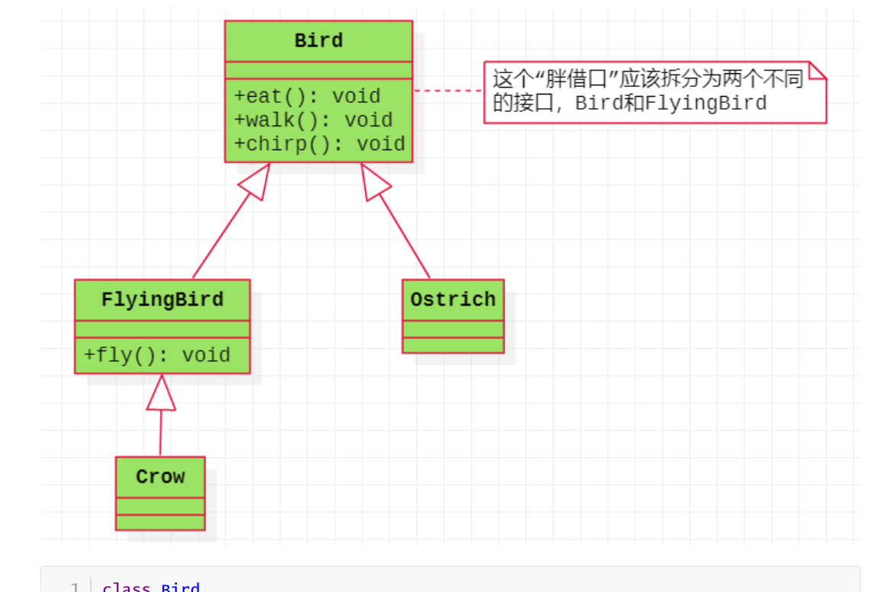5. 依赖导致原则

核心：面向接口编程，依赖于抽象(抽象是稳定的，具体的是在变化的)

在此处面向接口编程，说的就是纯虚函数，包含纯虚函数的类，称为抽象类，抽象类是稳定不变的。

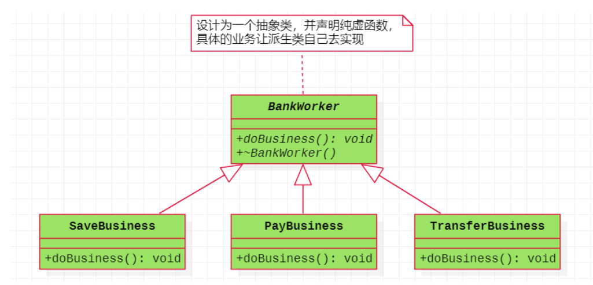

**在大多数情况下，开闭原则、里氏代换原则和依赖倒置原则会同时出现，开闭原则是目标，里氏代换原则是基础，依赖倒置原则是手段。**


### 6. 最少知识原则

核心：尽量减少类与类之间的耦合程度，或者模块与模块的关系


### 7. 组合复用原则

核心：尽量采用组合、聚合的方式而不是继承的方式来达到软件复用的目标

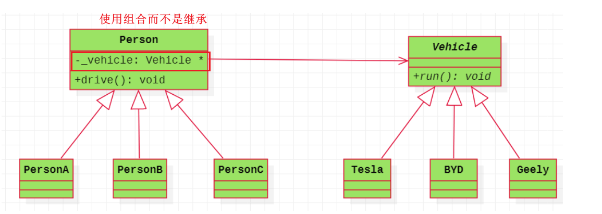


## 设计模式

### 工厂模式

#### 简单工厂（静态工厂）

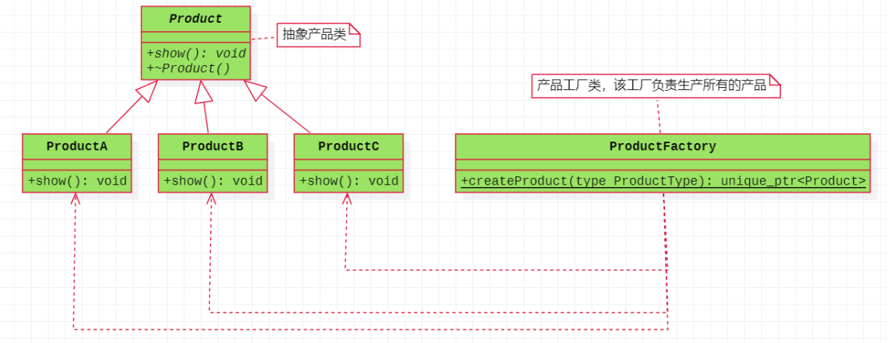

#### 工厂方法

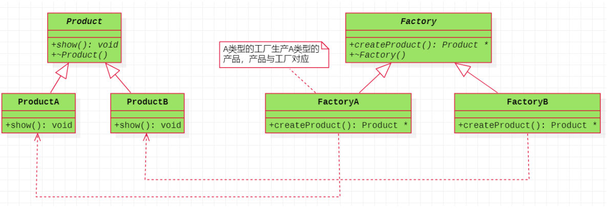

#### 抽象工厂

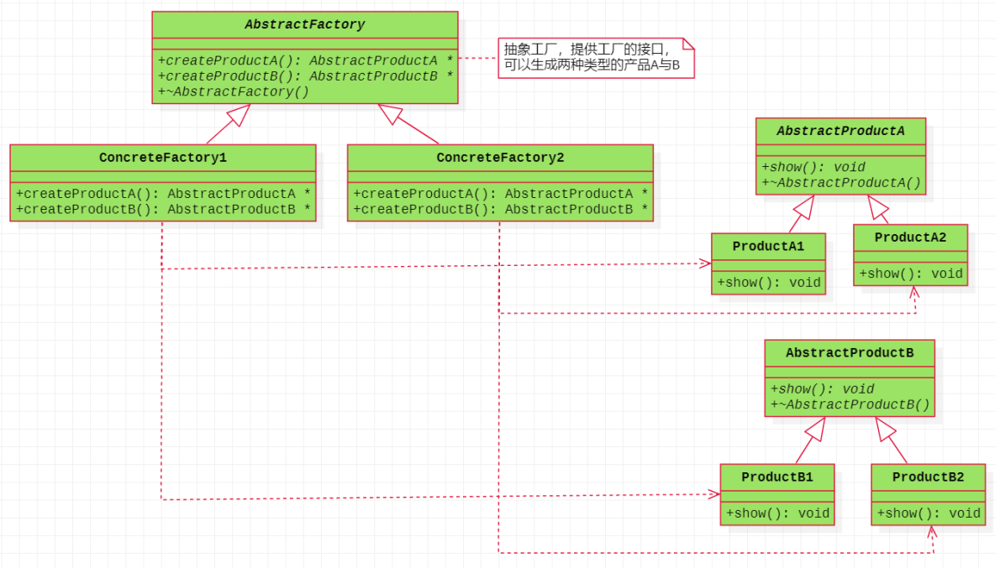

#### 观察者模式

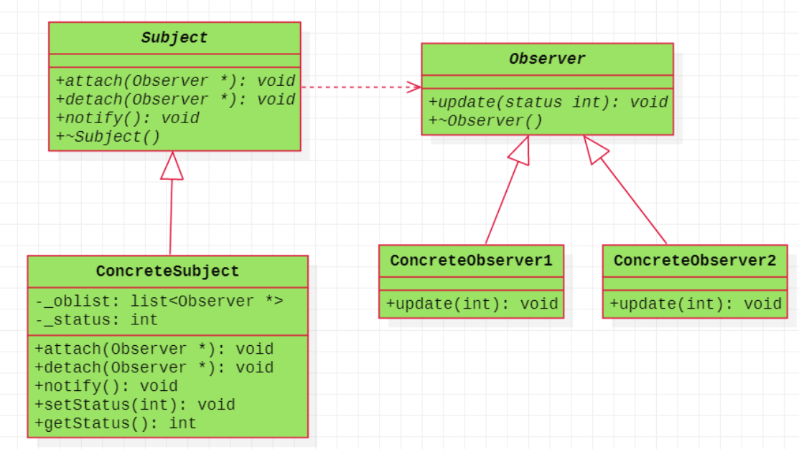


## 三、线程的封装

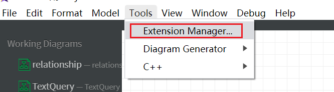

搜索C++，然后进行安装，就会出现C++

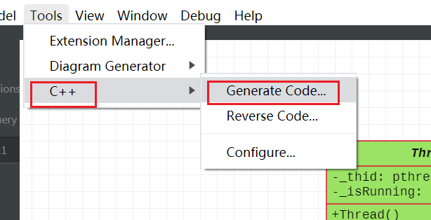


多标签问题：

：bn切换到下一个

：bp切换到上一个

：bd可以关闭当前标签

### 面向对象的线程封装

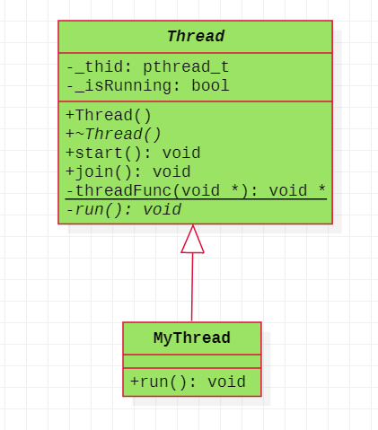

1、threadFunc要设置为静态成员函数，消除this指针的影响

2、run方法如何在threadFunc中进行调用？可以在pthread_create方法中，将第四个参数使用this传进来，将this使用arg传进来，就可以在threadFunc中调用run方法，并且该run方法是可以体现多态，调用派生类run方法


### 基于对象的线程封装


将run方法看做一个任务，使用bind与function的方法进行实现。

**ctrl + v 可视化，方向键 j，shift + i，输入相应的文字，最后按ESC**

## 生产者消费者

### 1、原理图

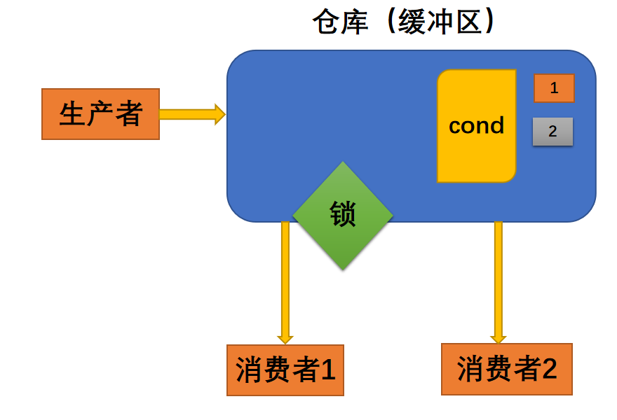

### 2、类图

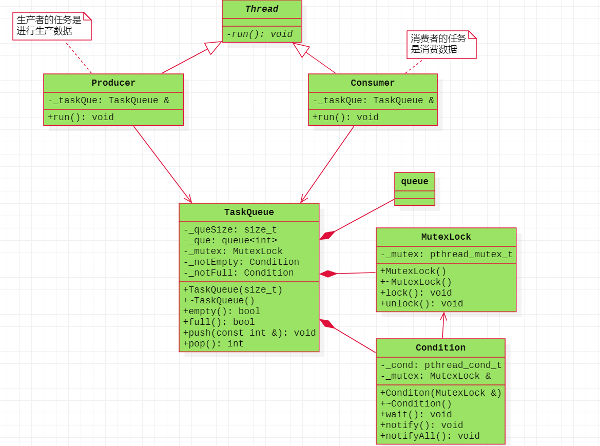

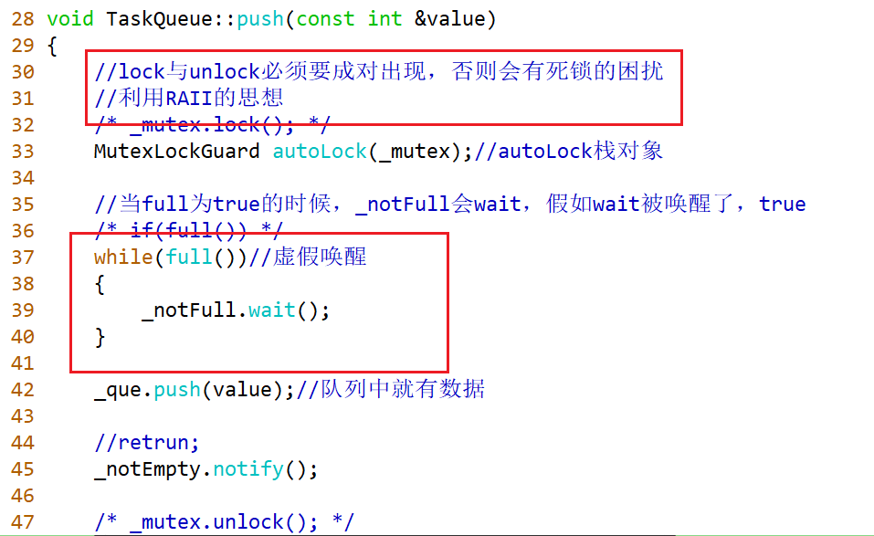

### 禁止复制

如果想体现对象语义的话，可以将类的拷贝构造函数与赋值运算符函数设置为私有的或者delete，还可以使用继承的观点，将基类的拷贝构造函数与赋值运算符函数删除或者设置为私有的，派生类继承基类的时候，就不能进行复制或者赋值。

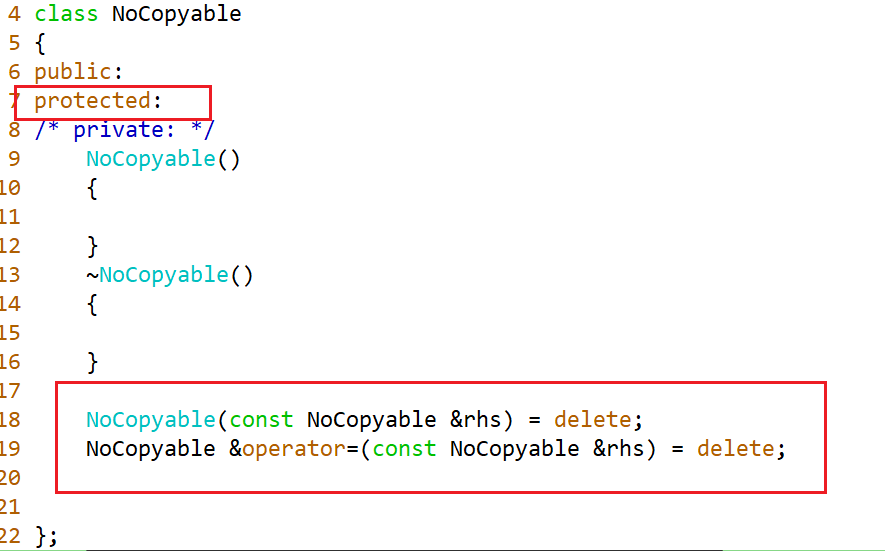


> Pthread_cond_signal在实现时唤醒不止一个线程。
>
> 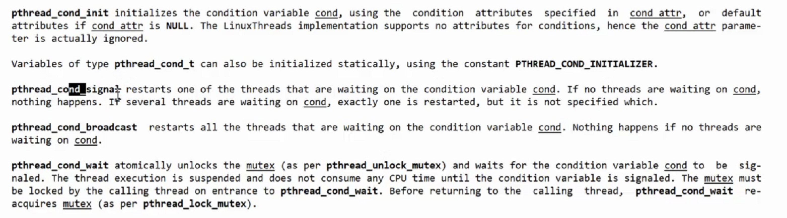
>
> 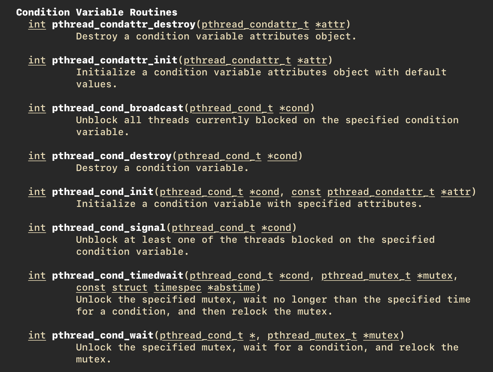


> vector<Unique_ptr<Thread>> threads;
>
> threads
>
> ```
> _threads.push_back(up); //会执行拷贝构造函数，然而unique_ptr不能拷贝构造
> _threads.push_back(std::move(up)); //只能传右值，移动拷贝。
> 
> ```

